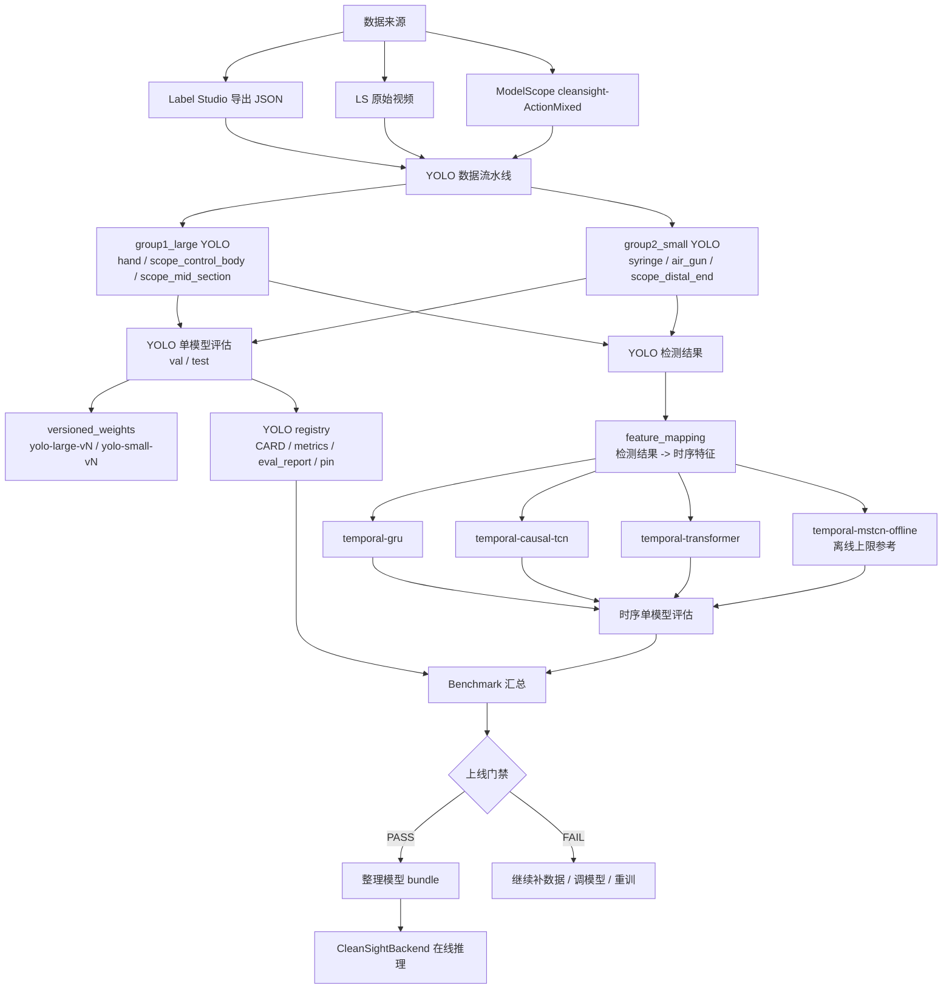
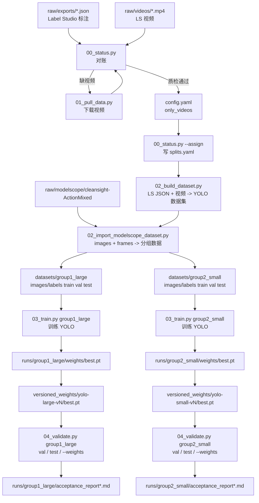
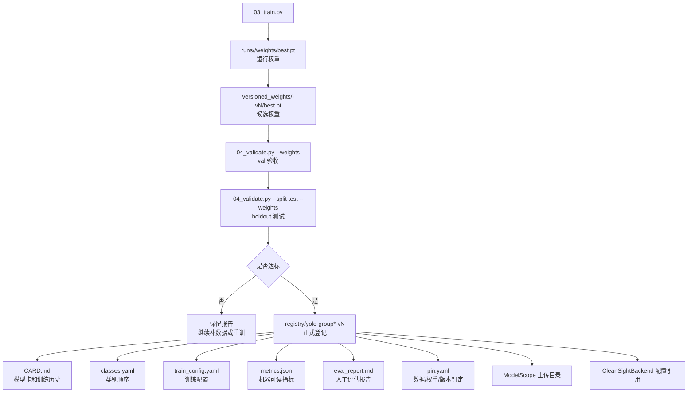
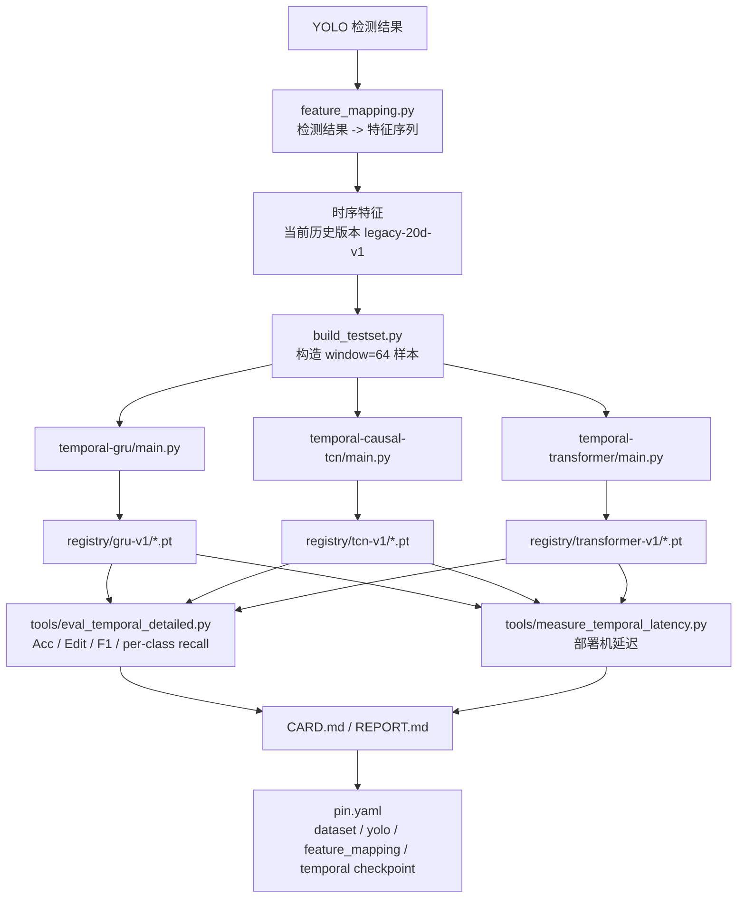
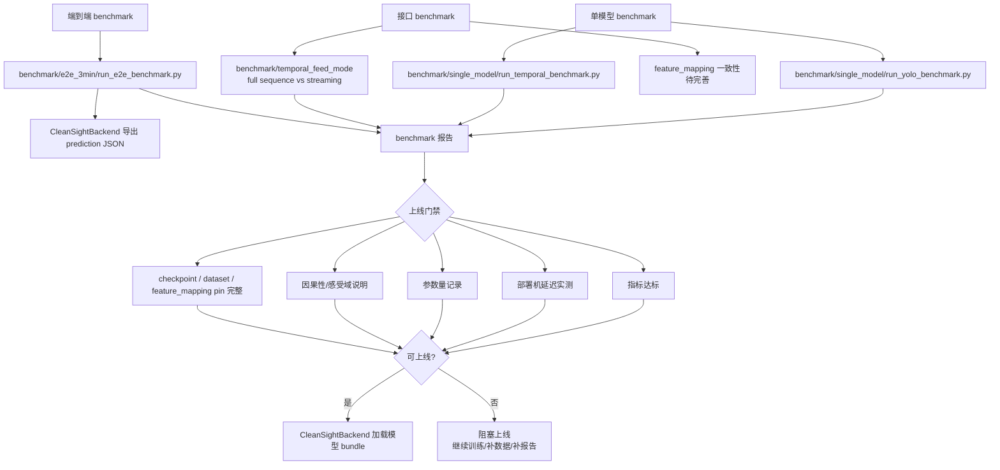
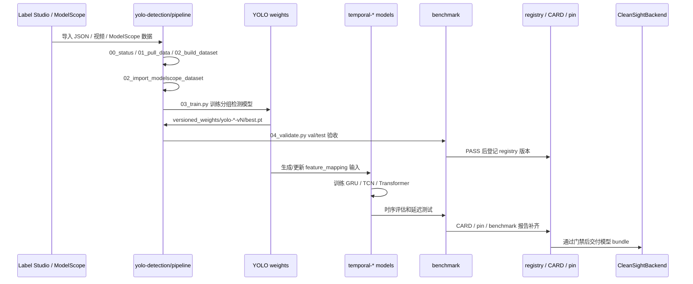

# CleanSight Models 项目流程图

本文档描述 `Cleansight_models` 当前的端到端模型资产流程。仓库边界是:本仓库负责训练、评估、版本登记和模型卡;`../CleanSightBackend` 负责在线加载、视频流推理、可视化和告警。

## 总览

## YOLO 数据、训练和评估流程

## YOLO 版本管理流程

当前已有自动化:

- `03_train.py` 会复制 `runs/<group>/weights/best.pt` 到 `versioned_weights/<model>-vN/best.pt`。
- `03_train.py` 会通过 `yolo-detection/pipeline/utils/card.py` 追加训练历史到 registry 的 `CARD.md`。
- `04_validate.py` 会写 `runs/<group>/acceptance_report.md`、`acceptance_report_test.md` 和 timestamp 归档报告。

当前仍需补齐自动化:

- PASS 后自动创建新的 `registry/yolo-group*-vN/`。
- 自动生成 `metrics.json`、`eval_report.md`、`pin.yaml`。
- 自动合并 test、部署机延迟、参数量和上线门禁结论。

## 时序模型流程

## Benchmark 和上线门禁

## 一条典型操作链

