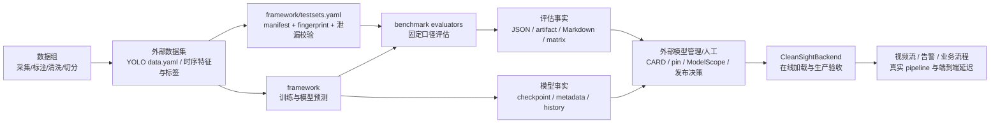
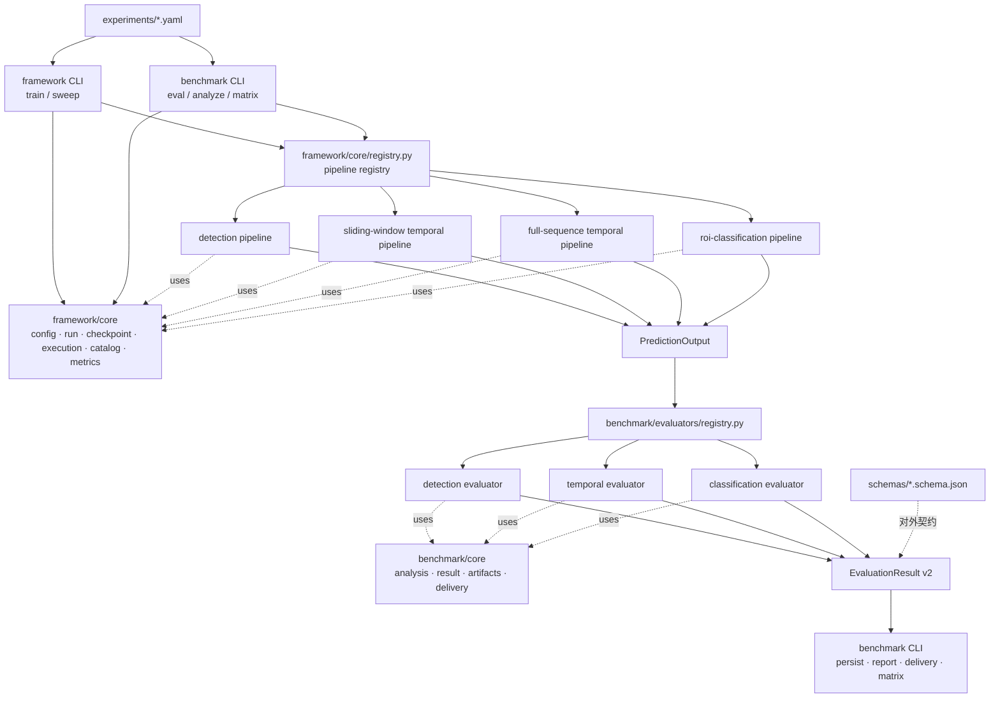
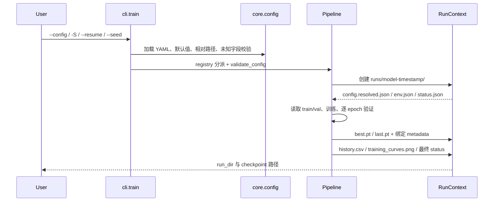
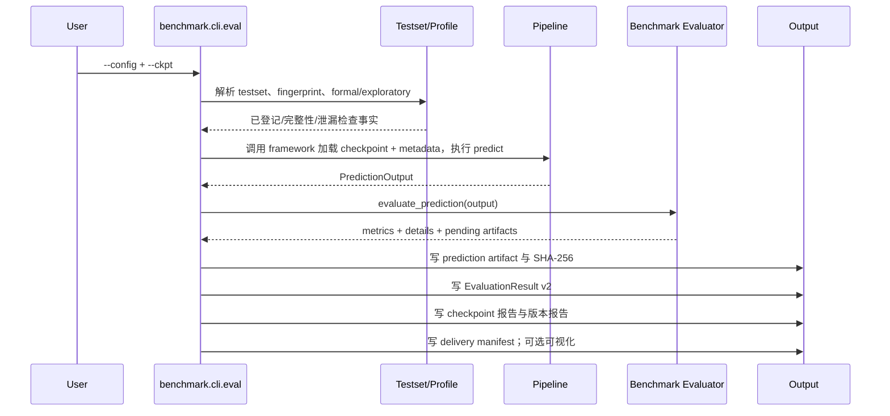

# CleanSight 模型集

> ## 🚀 组员请看这里
>
> **📖 [模型训练快速指南（TEAM_GUIDE）](docs/TEAM_GUIDE.md)** —— clone 后 5 分钟跑通第一个训练：
> 装环境 → 下载数据 → 训练，一条命令一个模型。
>
> ```bash
> python tools/team_env.py --setup-venv   # 1. 装环境
> python -m framework.cleansight_eval.cli.dataset --preset all  # 2. 下载数据
> python -m framework.cleansight_eval.cli.train --model yolo11s --group group1_large  # 3. 训练
> ```

本仓库负责 CleanSight 模型的训练、离线评估、benchmark、checkpoint 契约和交付清单，覆盖
YOLO 单帧检测与 GRU / MS-TCN / MS-TCN++ / Transformer 时序模型，以及 ROI 图像分类（特征融合）。

线上视频流、推理服务、告警以及真实 pipeline/端到端延迟由相邻的 [`CleanSightBackend`](https://github.com/Jiadezhende/CleanSightBackend) 负责；
本仓库只产出模型与评估事实，不自动决定发布或上线。

## 职责划分

| 模块 | 职责 |
|---|---|
| [`framework/`](framework/) | 配置、训练、run、checkpoint、模型注册与预测 |
| [`benchmark/`](benchmark/) | 评测 CLI、固定 testset、指标口径、结果/artifact/报告/交付契约 |
| [`schemas/`](schemas/) | 供外部系统消费的稳定 JSON Schema |
| [`registry/`](registry/) | 已登记模型的 CARD、pin、报告和历史 checkpoint |
| [`datasets/`](datasets/) | 本地数据挂载点；除说明文档外不进入 Git |
| [`legacy/`](legacy/) | 冻结的旧流水线与复现代码，仅供追溯，不被活跃代码依赖 |
| `CleanSightBackend` | 在线推理、业务流程、真实延迟与生产验收 |

## 完整架构

### 1. 系统上下文



边界原则：

- 数据组生产并维护数据；本仓库只读取、登记指针和校验消费条件。
- framework 训练模型、运行 checkpoint，并管理 run 内产物。
- benchmark 定义 testset、指标和稳定结果契约，不负责模型训练。
- 评估代码只输出事实，不执行自动发布、上传或上线动作。
- Backend 才是在线特征、流式推理和真实端到端验收环境。

### 2. 仓库模块结构

```text
Cleansight_models/
├── framework/
│   ├── experiments/                   # 多条流水线的实验 YAML（含 roi-fusion.yaml）
│   ├── cleansight_eval/
│   │   ├── cli/                       # train / sweep 入口
│   │   ├── core/                      # 配置、run、checkpoint、执行环境、
│   │   │                              #   数据契约 catalog、指标原语 metrics
│   │   ├── detection/                 # 单帧检测 pipeline + YOLO adapter +
│   │   │                              #   sweep 优化编排 + data_tools 裁剪
│   │   ├── classification/            # ROI 图像分类（特征融合）pipeline
│   │   └── temporal/
│   │       ├── models/                # 当前模型与历史 checkpoint 兼容实现
│   │       ├── sliding_window_pipeline.py
│   │       └── full_sequence_pipeline.py
│   └── tests/                         # framework 契约与 pipeline smoke tests
├── benchmark/
│   ├── core/                          # analysis、result、artifact、delivery 真源
│   │                                 （catalog/metrics 已下沉到 framework core）
│   ├── evaluators/                    # detection / temporal / classification 评估器
│   ├── manifests/                     # 固定 split 的样本指针
│   ├── single_model/                  # 历史批量单模型 benchmark 兼容入口
│   ├── temporal_feed_mode/            # 全序列 vs 流式喂入专项评估
│   └── e2e_3min/                      # 3 分钟业务场景评估
├── schemas/                           # 对外 JSON Schema，不含指标实现
├── usage/                             # YAML 配置索引和测试命令行教程
├── tools/                             # testset/CARD 等非模型执行工具
├── registry/                          # 模型版本元数据、报告与已登记权重
├── datasets/                          # 本地数据入口（内容默认忽略）
├── external_checkpoints/              # 外部权重的配套配置模板
├── legacy/                            # 冻结的历史 YOLO/时序实现和专项工具
├── runs/                              # 本地运行产物，不进入 Git
└── tests/                             # benchmark/schema/交付契约测试
```

活跃代码主路径是 `framework/ + benchmark/ + schemas/`。模型资产集中在 `registry/`，数据从
`datasets/` 挂载。`legacy/` 只保存迁移前快照，活跃模块禁止反向依赖它。

### 3. 运行时分层与依赖方向



关键依赖规则：

- `framework/core` 不 import 评测结果或报告；具体 Pipeline 只在 `core/registry.py` 汇合。
- detection / temporal / classification 三个纵向领域互不依赖，避免图像格式和时序特征格式互相污染。
- pipeline 只实现 `validate_config()`、`train()`、`predict()`，不拥有正式指标口径。
- `PredictionOutput` 是执行层与评估层的边界，不包含 `MetricValue`、报告字段或发布判定。
- benchmark CLI 调用 framework 的 Pipeline 执行模型，framework 不提供第二个评测入口。
- **依赖方向单向 `benchmark → framework`**：数据契约（`framework/testsets.yaml` →
  `framework/core/catalog.py`）与指标原语（`framework/core/metrics.py`）归 framework，
  benchmark 消费它们；framework 生产代码不 import benchmark。
- `EvaluationResult v2` 由 `benchmark/core/result.py` 唯一定义，旧 envelope 由该类型兼容读取。

### 4. 三条模型流水线

| 流水线 | 领域实现 | 模型/适配器 | 输入与监督 | 预测语义 |
|---|---|---|---|---|
| `detection` | `framework/.../detection/pipeline.py` | Ultralytics `YoloAdapter` | 图像与 YOLO 标签；训练由 Ultralytics 管理 | 单帧、无状态，输出框/类别/置信度 |
| `sliding_window_temporal` | `temporal/sliding_window_pipeline.py` | GRU；历史 GRU/Causal TCN/Causal Transformer 兼容实现 | `[B,window,F]`，窗口末帧监督 | 因果滑窗、逐 tick 前进、冷启动与因果平滑 |
| `full_sequence_temporal` | `temporal/full_sequence_pipeline.py` | GRU、MS-TCN、MS-TCN++、Transformer | `[1,T,F]`，逐帧监督 | 整段上下文、逐帧输出，主要用于离线评估 |

一个 checkpoint 的训练与评估必须属于同一条 pipeline。网络结构可以在不同 pipeline 中分别建立
实验，但输入构造、监督粒度、推理语义和 checkpoint metadata 必须各自闭环。

### 5. 训练链路



训练职责按 pipeline 隔离：检测训练委托 Ultralytics；两条时序 pipeline 自己管理 optimizer、验证、
best/last、resume、NaN/异常状态和训练历史。训练环境信息留在 run 中用于排障，不写进精简评估结果。

### 6. 评估链路



检测和时序在评估阶段的主要差异：

- YOLO 的 mAP/P/R 由 Ultralytics `val()` 计算，benchmark 负责统一三态、spec、逐类详情和有效参数；
  逐图预测 artifact 需要结合固定 testset 真值复算。
- 时序 evaluator 从逐视频预测与真值统一重算指标；Accuracy 使用跨视频帧 micro，Edit 使用逐视频
  macro mean，F1/P/R 使用每视频独立匹配后的 TP/FP/FN micro 聚合。
- 只有滑窗时序测量单窗模型 forward；检测、全序列和生产端到端延迟不在这里伪造。

### 7. 数据与模型契约

| 契约 | 关键内容 | 校验位置 |
|---|---|---|
| Experiment config v1 | pipeline、model、data、train、evaluation；默认值及字段来源 | `framework/core/config.py` |
| Testset catalog v2 | dataset/revision 公共契约、split manifest、labels、feature mapping、重叠策略和内容 fingerprint | `framework/testsets.yaml`、`framework/cleansight_eval/core/catalog.py` |
| Checkpoint metadata v1 | 模型重建配置、feature schema、训练数据版本及 split fingerprint、权重 SHA-256/大小绑定 | `framework/core/checkpoint.py`、`framework/temporal/data.py` |
| PredictionOutput | 模型身份、预测/真值、标签、推理语义、原生指标或 timing | `framework/core/execution.py` |
| EvaluationResult v2 | 三态指标、spec、testset、inference、artifact、integrity | `benchmark/core/result.py` |
| Prediction artifact v1 | detection 逐图预测；temporal 逐视频预测与真值 | `benchmark/core/artifacts.py` |
| Delivery manifest v1 | 文件角色、相对路径、required、大小、SHA-256、内容版本 | `benchmark/core/delivery.py` |

ActionMixed 时序输入当前使用 `actionmixed-bbox-8cls-v1`：8 个检测类，每类
`[presence,cx,cy,w,h]`，合计 40 维。类别顺序、阈值、归一化或维度变化都会形成新的 feature
mapping 版本，并通常要求重训时序模型。

如需对特定检测目标做固定输入消融，可在实验配置的 `feature_schema` 中增加
`mask_targets: [syringe, air_gun]`（也接受类别 ID）。统一数据入口会将这些目标各自对应的 5 维
清零，GRU、Transformer、MS-TCN 等模型结构和 `input_dim: 40` 均无需变化；未设置时保持原行为。

训练期概率遮罩使用独立的 `augmentation.target_mask`。当前 `frame_dropout` 在加载 train split
时按 seed 生成一次可复现遮罩，`probability` 表示每个指定目标在每个采样帧被清零的概率；
val/test 不应用该训练增强。完整示例见 `framework/experiments/gru-actionmixed.yaml`。

### 8. 产物与交付架构

```text
runs/<run-id>/
├── config.resolved.json               # 最终训练配置与字段来源
├── env.json                           # 训练环境，独立排障使用
├── status.json                        # running/succeeded/failed 等状态
├── history.csv                        # 时序逐 epoch 事实
├── training_curves.png                # 时序训练曲线
├── checkpoints/
│   ├── best.pt / last.pt
│   ├── best.pt.meta.json / last.pt.meta.json
│   ├── best.eval.md                   # checkpoint 专属报告
│   └── EVALUATION_REPORT.md           # 追加式版本报告
├── artifacts/
│   └── <pipeline>-<model>-<time>.predictions.json
├── evals/
│   ├── <pipeline>-<model>-<time>.evaluation.json
│   └── <pipeline>-<model>-<time>.delivery.manifest.json
└── viz/                               # 可选时序 GT/Prediction 图
```

`delivery.manifest.json` 只列出可交付文件和摘要，不复制、上传或发布文件。正式外部版本还应由模型
管理流程补齐 `CARD.md`、`pin.yaml`、ModelScope revision 和人工结论。

### 9. 扩展点

- 新增同架构规模：复制实验 YAML，只修改 `model`/`train` 参数。
- 新增时序网络：新增 `[B,T,F] → [B,T,C]` 的 `nn.Module`，在
  `temporal/models/__init__.py` 注册，再写实验 YAML；因果模型才可进入滑窗 pipeline。
- 新增 YOLO 权重或规模：只新增配置，继续复用 `YoloAdapter`。
- 新增非 YOLO 检测器：实现检测 adapter，并保持 `PredictionOutput` 边界不变。
- 新增 pipeline：在 framework registry 注册执行 pipeline，同时在 benchmark evaluator registry 注册
  对应评估器；不要把新任务指标写进 framework core。
- 新增外部消费者：优先消费 `schemas/`、evaluation JSON 和 delivery manifest，不依赖 Python 内部类。

### 10. 架构不变量

- `computed`、`not_applicable`、`missing` 三态严格区分，不用 0 代替未测。
- checkpoint 配置或摘要错配立即拒绝加载，不静默兼容。
- 不跨视频拼接后计算 Edit/F1，不混淆 micro 与 macro 聚合。
- 不把模型 forward microbenchmark 称为生产延迟。
- 不生成跨 YOLO/时序任务的综合分，也不自动决定发布上线。
- `runs/`、权重、数据和视频是本地产物，不作为源码提交。

核心统一链路为：

```text
experiment YAML + checkpoint + testset
              ↓
framework pipeline.predict()       运行模型，只产预测事实
              ↓
benchmark evaluator                计算/整理固定口径指标
              ↓
EvaluationResult + artifact + Markdown 报告 + delivery manifest
```

## 快速开始

以下命令统一从仓库根目录执行。

### 1. 环境

```bash
source ../CleanSightBackend/.venv/bin/activate
pip install -r framework/requirements.txt
```

纯时序任务不需要 Ultralytics；运行 YOLO 时需要安装 `ultralytics`。无图形界面的机器可设置：

```bash
export MPLBACKEND=Agg
export MPLCONFIGDIR=/tmp/matplotlib
```

### 2. 获取数据集（可选）

首次使用 YOLO 检测数据时，可从 ModelScope 下载标准 YOLO 格式数据集
`lhh010/cleansight-yolo`（`group1_large` + `group2_small`，含 train/val/test）：

```bash
pip install modelscope
# token 通过 MODELSCOPE_TOKEN 环境变量或仓库根目录 .env 提供
python download_modelscope_dataset.py --preset yolo
```

下载到 `datasets/cleansight-yolo/`（默认被 `.gitignore` 排除）；
新数据才是正确版本。两个分组各带
`data.yaml`，可直接用于 Ultralytics 或框架训练：

```bash
# 直接用 Ultralytics（data.yaml 的 path: . 相对分组目录，需在分组目录内执行）
cd datasets/cleansight-yolo/group1_large
yolo detect train data=data.yaml model=yolo11n.pt epochs=100 imgsz=640

# 或用框架（data.data_yaml 覆盖为下载的 data.yaml，路径相对仓库根目录）
python -m framework.cleansight_eval.cli.train \
  --config framework/experiments/yolo-clean-large.yaml \
  -S data.data_yaml=datasets/cleansight-yolo/group1_large/data.yaml
```

`--preset` 还可选 `actionmixed` / `raw`；或传 `--dataset <id|url> --output <dir>` 手动指定其他
ModelScope 数据集。下载的 YOLO 数据若要进入正式 benchmark，需要先在 `framework/testsets.yaml`
登记新 dataset/testset 并跑 `tools/validate_testsets.py` 校验。

### 3. 评估前校验测试集

```bash
python tools/validate_testsets.py --catalog framework/testsets.yaml --json
```

`formal` 评估要求 testset 已登记且校验通过。默认以 `split_overlap_policy: error` 阻断同源视频
跨 split；小数据开发阶段可设置 `frame`，允许同源视频分段但禁止具体帧重复。`allow` 会完全放宽
跨 split 重叠门禁，只应用于特殊排查。策略会进入 fingerprint 和评测元数据，非 `error` 结果不能
描述为独立同源隔离测试。

### 4. 训练

```bash
# YOLO 检测
python -m framework.cleansight_eval.cli.train \
  --config framework/experiments/yolo-clean-large.yaml

# GRU 因果滑窗
python -m framework.cleansight_eval.cli.train \
  --config framework/experiments/gru-actionmixed.yaml

# Transformer 全序列
python -m framework.cleansight_eval.cli.train \
  --config framework/experiments/transformer-actionmixed.yaml
```

临时调参使用通用点路径覆盖，不修改 YAML：

```bash
python -m framework.cleansight_eval.cli.train \
  --config framework/experiments/gru-actionmixed.yaml \
  -S train.epochs=5 -S train.lr=0.0005
```

时序训练会保存 `best.pt`、`last.pt`、`history.csv`、`training_curves.png` 和 `status.json`；
YOLO 训练复用 Ultralytics 的 `results.csv`、`results.png` 和 best/last 权重。

### 5. 评估

```bash
# YOLO
python -m benchmark.cli.eval \
  --config framework/experiments/yolo-clean-large.yaml \
  --ckpt runs/<yolo-run>/checkpoints/group1_large/weights/best.pt

# GRU
python -m benchmark.cli.eval \
  --config framework/experiments/gru-actionmixed.yaml \
  --ckpt runs/<gru-run>/checkpoints/best.pt

# Transformer
python -m benchmark.cli.eval \
  --config framework/experiments/transformer-actionmixed.yaml \
  --ckpt runs/<transformer-run>/checkpoints/best.pt
```

评估输出会自动定位到 checkpoint 所属 run：

```text
runs/<run>/
├── checkpoints/
│   ├── best.pt
│   ├── best.pt.meta.json
│   ├── best.eval.md                 # 当前 checkpoint 专属报告
│   └── EVALUATION_REPORT.md         # 追加式版本报告
├── evals/
│   ├── *.evaluation.json            # EvaluationResult v2
│   └── *.delivery.manifest.json     # 可交付文件及 SHA-256
├── artifacts/
│   └── *.predictions.json           # 逐图/逐视频预测
└── viz/                             # 支持的流水线可视化
```

检测报告包含 mAP@0.5、mAP@0.5:0.95、整体/逐类 P/R；时序报告包含 Accuracy、Edit、
F1@0.1/0.25/0.5、TP/FP/FN、P/R、Temporal IoU 和帧级指标。模型前向基准只在因果滑窗
流水线测量，不代表生产端到端延迟。

### 6. 汇总矩阵

```bash
python -m benchmark.cli.matrix --runs runs
python -m benchmark.cli.matrix --runs runs --pipeline detection
```

矩阵保留 `computed`、`not_applicable`、`missing` 三态，不生成跨任务综合分。

### 7. 测试

```bash
pytest
```

## Formal 与 Exploratory

- `formal`：要求已登记且校验通过的 testset、绑定 checkpoint SHA-256 的 metadata，以及预测 artifact。
- `exploratory`：用于外部导入权重、临时数据或数据校验尚未通过的调试；报告会保留降级事实。
- 外部 YOLO `.pt` 可以配合 `model.allow_missing_meta: true` 做 exploratory 评估；正式归档前应重新
  训练或补齐可信的 `.pt.meta.json`，不能只靠文件名推断模型身份。

## Schema 与交付

[`schemas/`](schemas/) 当前包含：

- `evaluation-result-v2.schema.json`：统一评估结果；
- `prediction-artifact-v1.schema.json`：YOLO 逐图与时序逐视频预测；
- `delivery-manifest-v1.schema.json`：checkpoint、报告、配置和 artifact 的交付清单。

Schema 不计算指标，也不上传文件。仓库内部由 Python 校验器保证运行时结构；这些 JSON Schema 用于
CI、ModelScope 打包脚本、后端或其他语言实现读取稳定契约。

## Git 与模型资产

默认不要提交 `.pt/.pth/.onnx/.engine`、`runs/`、`checkpoints/`、视频、原始数据和本地密钥。
源码仓库优先提交配置、脚本、Schema、CARD、pin、精简报告与复现说明。正式模型版本建议至少具备：

```text
checkpoint + checkpoint metadata + CARD.md + pin.yaml
+ evaluation.json + checkpoint report + delivery manifest
```

## 文档索引

- [架构简述](docs/ARCHITECTURE_OVERVIEW.md)：用目录和数据流快速说明当前仓库结构。
- [YAML 配置文档](usage/YAML_CONFIG.md)：所有受跟踪 YAML 的内容、读取方、功能和快速定位链接。
- [测试命令行教程](usage/TEST_COMMANDS.md)：模型评测、timeline、矩阵和 pytest 的常用写法。
- [模型集总览](docs/MODELSET_OVERVIEW.md)：现状、使用入口与汇报要点（合并原 STATUS/PRESENTATION/USAGE 三份）。
- [项目流程](docs/PROJECT_FLOW.md)：数据、训练、评测与交付的流程关系。
- [framework README](framework/README.md)：CLI、配置字段、resume 与扩展点。
- [YOLO 优化工作流](docs/YOLO_OPTIMIZATION.md)：sweep / analyze / 特征融合的操作指南。
- [YOLO 自动标注工具](docs/AUTO_ANNOTATION.md)：视频 → legacy 标注 JSON → 时序训练数据，以及图片帧序列数据集 → 时序训练数据（frames/ + labels/）的完整使用指南（run / run-dataset / convert / 优化参数 / 训练链路）。
- [自动标注快速上手](docs/AUTO_ANNOTATION_QUICKSTART.md)：最小命令集，5 分钟跑通 run / run-dataset / convert 与常见报错排查。
- [数据集构建要求（Label Studio）](docs/DATASET_BUILDING_GUIDE.md)：队友通过 Label Studio 构建/扩充训练数据的硬性契约与操作步骤（只需标动作标签，不画框；目标框由 YOLO 自动标注），以及后续数据维护的注意事项（类别覆盖/平衡、增量扩量、版本与登记联动）。
- [YOLO 结果人工审核流程](docs/YOLO_REVIEW_FLOW.md)：YOLO 预标注 → Label Studio 人工改框+标动作 → 导出 → convert 的质量门闭环。
- [推理链路性能测量](docs/INFERENCE_CHAIN_PERF.md)：YOLO 检测 / 特征化 / 时序推理的实测时延，支撑"预计算入数据集 vs 现场推理"决策。
- [评估能力说明](docs/EVAL.md)：指标定义、聚合口径和完整性检查。
- [benchmark README](benchmark/README.md)：单模型、feed-mode 和端到端 benchmark。
- [新模型接入手册](docs/MODEL_ONBOARDING.md)：新增时序网络或检测器。
- [实现状态](docs/TRAIN_EVAL_IMPLEMENTATION_STATUS.md)：当前能力与剩余事项。
- [设计准则](docs/DESIGN.md)：framework/benchmark 职责与抽象边界。
- [Git 分支约定](docs/BRANCH_CONVENTION.md)：分支体量、提交纪律与合并流程（方案 C）。

迁移前的独立实现已冻结到 [`legacy/`](legacy/)；它们不属于受支持的训练或评测入口。历史权重已由
framework 兼容模型接管，可通过 `framework/experiments/legacy-*.yaml` 运行。新训练使用
`framework.cleansight_eval.cli.train`，统一评测使用 `benchmark.cli.eval` /
`benchmark.cli.matrix`。
