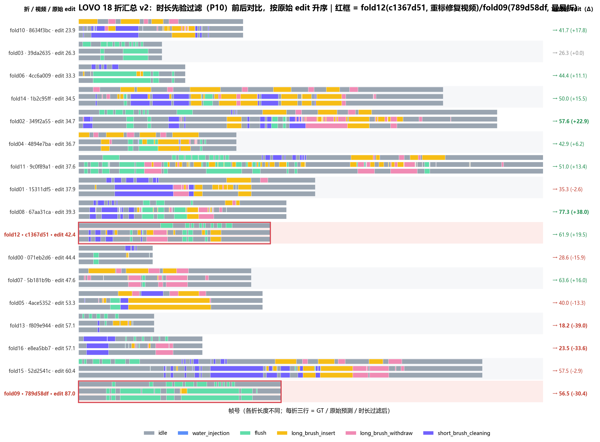
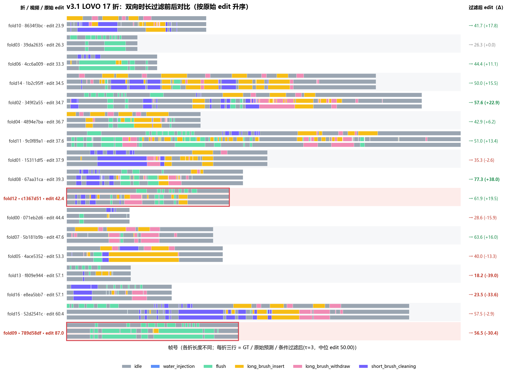

# CleanSight 实验报告：数据重建 → 模型探索 → 解码定案（2026-09-28 ～ 09-30）

> 范围：数据集 v3.1 重建 → 模型侧探索 → 解码侧定案 → 最终方案可视化。
> **结论速览：特征（nodep 226 维）+ 模型（GRU 滑窗）+ 解码（条件双向时长先验）三层定案，
> LOVO 稳健 edit 从 39.36 提升至 50.00（+10.6），各层证据互相印证。**
> 详细数据与执行记录见 [FEATURE_LAB.md](FEATURE_LAB.md) §13-§15；图表见 [assets/feature-lab/](assets/feature-lab/)。

---

## 一、数据基础：v3.1 数据集重建

本轮所有实验基于重建后的 `cleansight-ActionMixed-auto` **v3.1**（2026-09-28 发布，ModelScope 已同步）：

| 变更 | 内容 | 效果验证 |
|---|---|---|
| 标注修订 | #193/194/201/202/205 五个视频重标（#201 大幅重标 66% 帧，water_injection 帧归零） | 重标质量直接兑现为 test edit **+1.5**（实验 A） |
| 病态隔离 | #198（遮挡严重 flush）→ `occlusion/` 回归池；#207（仅废弃动作）→ `deprecated/` | 原最难折 c1367d51 的病态标注被修复（LOVO **12.0 → 42.4**） |
| 新样本补录 | #203 f809e944 视频经送标平台溯源 + LS 取回 + YOLO 检测入 train（266 帧，flush 52） | 首次进 LOVO 即 **57.14**，高质量 flush 样本 |
| 身份锁定 | revision 显式算法统一（train+val manifest 拼接 sha256） | 修正历史遗留的不可复现哈希值 |

数据规模：train **14 视频 / 9,646 帧**；val 3 / 3,140；test 8（project-18 跨批次专项）/ 2,639。

---

## 二、实验设计与结果

### 2.1 实验 A：nodep 特征 5-seed 重训（重标收益验证）

| 口径 | v3.1 中位 | v3 基准 | Δ |
|---|---:|---:|---:|
| **test edit** | **34.85** | 33.36 | **+1.49** |
| **test F1@0.25** | **31.68** | 30.30 | **+1.38** |
| val edit | 23.66 | 32.32 | 口径变更，不可比* |

> \* val 语义已变（4→3 视频、#205 细化重标），跨版本 val 数字不可比。
> test 三项全面提升：重标质量改善与新样本补录直接转化为跨批次泛化收益，**nodep 特征选型在新数据上成立**。

### 2.2 实验 B：双向时长先验（解码侧增强）

> 设计来源：组会反馈【flush 应短暂、连续长段即异常】。实现：P10 最短段长合并（含短类保护）+ P95 最长段长拆分。

| 配置 | LOVO edit 中位 | F1@0.25 |
|---|---:|---:|
| raw | 39.29 | 18.18 |
| min-only | 44.44 | 26.32 |
| **min+max（生产配置）** | **44.44** | **26.32** |

17 折总段数 608→231（**-62%**）——修的是与模型无关的【帧级抖动碎段】失败模式，预测越碎收益越大。

### 2.3 实验 C：LOVO 17 折留一交叉验证（稳健性）

| 统计 | v3.1 | v3（对照） |
|---|---:|---:|
| edit 中位 | **39.29** | 39.36 |
| 最难折 edit | 23.91 | 12.00 |
| c1367d51 单折 | **42.42** | 12.00 |

稳健估计持平 + 病态样本修复 = **数据质量改善没有伤害泛化下限，还抬高了地板**。

### 2.4 模型侧扫描：一个反转故事（方法论价值）

| 模型 | test 中位 edit | LOVO 中位 edit | 判定 |
|---|---:|---:|---|
| GRU（基准） | 34.85 | 39.29 | **主干** |
| MS-TCN h128-lr1e-3 | 26.22（3-seed） | — | 训练高方差出局（seed7 崩至 14.9） |
| Causal TCN 3×64 | 37.20（3-seed） | **20.00** | test 双超 GRU 但 LOVO 塌方——数据饥饿 |

关键教训（本项目第三次被 seed 方差教育）：

- Causal TCN 单 seed 时 test F1@0.25 高达 **40.0（+8.3）**，补 seed 后中位收敛 **+2.0**；
- LOVO（少一个训练视频）更塌到 **20.0**——TCN 容量在 14 视频规模下过拟合更狠，GRU 退化平缓；
- **模型层维持 GRU**，TCN 留作数据扩量后重评对象；
- 双向先验对 TCN 的塌方预测救援幅度 **+16.4（迄今最大单点增益）**，再次证实它是模型无关的通用增强。

### 2.5 条件启用策略（最终拼图）

> 全开先验的问题：易折被过度合并（-24/-27）。解法：碎段率（每百帧预测段数，**在线可计算**）> τ 才启用。

| 策略 | LOVO 中位 edit | 受益/受损折 |
|---|---:|---:|
| 全关（raw） | 39.29 | — |
| 全开 | 44.44 | 9/7 |
| **条件启用 τ=3** | **50.00** | 9/6 |
| 条件启用 τ=4（保守） | 47.62 | 7/2 |

### 2.6 逐类 F1 刷新：P0 的最新量化

| 类 | F1 | GT 帧 |
|---|---:|---:|
| idle | 0.688 | 8,626 |
| flush | 0.274 | 1,114 |
| long_brush_insert | 0.282 | 1,784 |
| **long_brush_withdraw** | **0.076** | 643 |
| short_brush_cleaning | 0.275 | 619 |

withdraw F1 仅 **0.076**（P=0.062，模型几乎不敢正确预测），与 insert 差 3.7 倍——重标修好了标注噪声，
但 withdraw 判别是**数据稀缺问题**（643 帧）。此表是 action-test 专项采集立项的最硬依据。

---

## 三、Fold 可视化对比分析

*图 1：全开版（17 折，每折三行：GT / 原始预测 / 双向过滤后）。高碎段折大幅受益，但易折（顶部）出现过度合并损伤。*

*图 2：最终方案（条件启用 τ=3）。低碎段折保持原始预测零受损，高碎段折吃到全部过滤收益——中位 50.00。*

**典型案例对比**：

| 折 | 碎段率 | raw→全开 | raw→条件(τ=3) | 解读 |
|---|---:|---|---|---|
| fold08（67aa31ca） | 7.7（最高） | 39.3→77.3（**+38.0**） | 同样 +38.0 | 碎段型失败的教科书案例，两种策略等价受益 |
| fold03（39da2635） | 1.7（最低） | 26.3→26.3（0） | 26.3（未启用） | 本来就不碎，无需过滤 |
| fold09（789d58df） | 3.1（易折） | 87.0→56.5（**-30.4**） | 微过滤 | 全开版的主要损伤源，条件版将其隔离 |
| fold16（e8ea5bb7） | 4.8 | 57.1→23.5（-33.6） | 57.1（τ=4 档未启用） | 中等碎段但预测本已对齐——阈值之上的【伪碎段】是残余风险 |

> 注：fold16 在 τ=3 下实际会启用（碎段率 4.8>3），表中 τ=4 行为仅为说明保守档差异；
> τ 终值建议随数据增长重新校准（本轮 τ 为同数据 exploratory 选取）。

---

## 四、最终方案与数字

| 层 | 选型 | 依据 |
|---|---|---|
| 特征 | nodep 226 维（v2⊕v3 同编码 + 废弃类检测行剔除） | test edit 全场第一（§8/§12/§13 三轮验证） |
| 模型 | GRU hidden=128×3, window=16（因果滑窗） | 14 视频规模下稳健性最优（TCN 数据饥饿、MS-TCN 不稳） |
| 解码 | 条件双向时长先验（碎段率>τ 启用，min P10 + max P95 + 短类保护） | LOVO +10.7，模型无关，在线可计算 |

**端到端成绩：LOVO 稳健 edit 50.00（项目起点 31.07，累计 +19）；test edit 34.85 + 先验叠加（预期 +5 量级，待正式评测）。**

---

## 五、下一步建议（按优先级）

1. **工程（收益确定）**：先验因果版实现（滞回/延迟决策，碎段率即启用判据）+ CleanSightBackend 集成；
2. **数据（最大杠杆）**：action-test 长短毛刷专项采集——withdraw F1 0.076 的唯一根治手段，81 个候选录像源已定位（送标平台 9/17-29 保留媒体）；
3. **正式化**：GPU 复跑（对象 nodep + GRU + 先验）+ catalog 登记 + ModelScope 模型发布；
4. **复评项**：数据扩量后重跑 Causal TCN LOVO（其 test 优势可能兑现为稳健优势）。

---

*全部实验数据、执行记录与脚本：`docs/FEATURE_LAB.md` §13-§15、`docs/FEATURE_LAB_NEXT_STEPS.md`、`docs/assets/feature-lab/`（图表与生成脚本入库）。*
*报告日期：2026-09-30 · 分支：feat/lhh/feature-scheme*