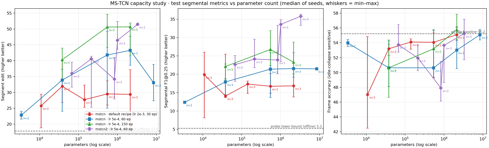

# 实验报告：MS-TCN 参数量（容量）研究 · 五条实验线 × 多 seed

- 日期：2026-09-22
- 目的：回答三个问题——**① 当前 mstcn 有多大、输入变大时参数量怎么变；② 加大参数量对训练与预测内容
  到底有什么影响、有效区间在哪；③ 与"换结构 / 加特征"相比，加参数值不值。** 所有结论都给出判读等级
  （可判读 / 不可判读）与噪声地板。
- 一句话结论：**默认配方（lr=0.002）下加大参数无效甚至更糟；把 lr 降到 1/4 后 `mstcn` 在 h128
  达到有效上限（h128 vs h32 逐 (seed,视频) 配对 28/10、p=0.0026；h256 与 h128 等价 p=0.80）。
  真正的增量在"换结构"和"加特征"：`mstcn2` h128/s4l10（331 万参）60 轮 edit 51.47 且逐 seed 摆幅仅 0.64，
  超过 `mstcn` 跑 150 轮的水平；40→144 维特征在 h32 上 edit +14.29（p=0.020）而参数量只 +9%。**
- 规模：**122 个 run**（110 个带正式评估），覆盖 5 条实验线；全部为 CPU 训练。

## 1. 实验设置

| 项 | 值 |
|---|---|
| 数据 | `datasets/cleansight-ActionMixed-auto-lhh`；视图 `temporal.actionmixed-auto-roi-v1`（144 维）与 `temporal.actionmixed-auto-v3`（40 维）；revision `6375eba95c28…` |
| 规模 | train 14 视频 / 9,575 帧、val 4 / 3,384、test 8 / 2,639（每 4 帧采样 1，≈7.5 fps） |
| 测试集 | 两个视图的 test **视频逐条一致**（8 个 clip）；`testset.fingerprint_sha256` 不同是因为指纹含 `feature_mapping`/`input_dim` |
| 特征 | `actionmixed-roi-grid-v1` 144 维（主）／`actionmixed-bbox-8cls-v1` 40 维（对照）；输入 `[1, T, F]` |
| 模型 | `mstcn`（单 stage、8 个膨胀残差块、双向非因果）；`mstcn2`（1 生成 + N−1 精化 stage、双膨胀、深监督、T-MSE、dropout 0.3） |
| 配方 | Adam，lr ∈ {2e-3, 1e-3, 5e-4}；epochs ∈ {20(patience=4), 30, 60, 150}；weight_decay 1e-4；grad_clip 5；**选点 `best_metric=val_f1_0.5`**；类别加权 CE |
| 设备 / seed | **CPU（WSL，`env.json` device=cpu）**；seed 42 / 7 / 2026（150 轮臂补到 5 个：+1234 / 99） |
| 主要命令 | `python tools/run_capacity_matrix.py --runs-dir <批次> --hidden <列表> --seeds <列表> --epochs <N> [--set ...]` |
| 产物 | 每批 `runs/<批次>/CAPACITY_SUMMARY.md` + 逐 run `evals/*.evaluation.json`、`artifacts/*.predictions.json`、`history.csv`、`checkpoints/best.pt(.meta.json)` |

> 设备口径说明：全部为 CPU，且仓库既有约定"正式基线锚定设备口径"，本报告的绝对数字不与 GPU 轮混用。

## 2. 结果

### 2.1 主结果：参数量 vs test 段级指标



图由 [`tools/plot_capacity_curves.py`](../tools/plot_capacity_curves.py) 从各 run 的
`eval*/evaluation.json` + checkpoint meta 直接生成（折线 = seed 中位数，误差棒 = 跨 seed 最小–最大；
虚线 = 逐帧线性探针下界 / 全 idle 基线）；机读数据在同一目录的 `capacity_vs_segmental.json`。

**曲线 1 · `mstcn` 默认配方（lr=2e-3、30 轮、patience 关）**

| 参数量 | n | edit 中位（min–max） | F1@0.25 中位 |
|---:|---:|---|---:|
| 10,870 (h16) | 3 | 25.78（18.83–29.46） | 19.90 |
| 38,118 (h32) | 3 | **31.95**（26.87–40.00） | 14.06 |
| 141,766 (h64) | 3 | 27.71（25.33–32.32） | 17.34 |
| 545,670 (h128) | 3 | 29.53（26.04–33.63） | 16.73 |
| 2,139,910 (h256) | 3 | 29.40（18.73–37.14） | 16.84 |

→ **没有趋势**：曲线平坦且各点摆幅大于点间差；h256 还伴随 idle 坍缩（非 idle 预测帧中位 115，真值 1181）。

**曲线 2 · `mstcn` lr=5e-4、60 轮**

| 参数量 | n | edit 中位（min–max） | F1@0.25 中位 |
|---:|---:|---|---:|
| 3,390 (h8) | 2 | 22.84（21.58–24.10） | 12.36 |
| 38,118 (h32) | 3 | 33.91（24.07–37.34） | 17.91 |
| 545,670 (h128) | 3 | 41.79（25.05–49.22） | 21.40 |
| 2,139,910 (h256) | 3 | **43.27**（38.56–47.72） | 21.56 |
| 8,474,118 (h512) | 2 | 33.09（27.34–38.85） | 21.47 |

→ 降 lr 后**曲线立起来了**（h32→h256 单调上升），但 **h512 回落**（train 最低 0.159 = 拟合最好，
val 最低 1.472 不如 h256，段级 edit 掉回 h32 水平）→ 这是过拟合而不是容量不足。

**曲线 3 · `mstcn` lr=5e-4、150 轮（5 seed）**

| 参数量 | n | edit 中位（min–max） | F1@0.25 中位 |
|---:|---:|---|---:|
| 38,118 (h32) | 5 | 40.29（33.91–43.97） | 22.12 |
| 545,670 (h128) | 5 | **50.60**（44.21–54.65） | 26.76 |
| 2,139,910 (h256) | 5 | 50.67（41.54–51.88） | 23.31 |

→ **h128 与 h256 中位数打平（50.60 vs 50.67）**，即 `mstcn` 的有效上限在 **54.6 万参**附近。

**曲线 4 · `mstcn2` lr=5e-4、60 轮**

| 组合 | 参数量 | n | edit 中位（min–max） | F1@0.25 中位 |
|---|---|---:|---|---:|
| h32/s2/l5 | 67,500 | 3 | 36.00（31.66–39.55） | 22.64 |
| h32/s4/l10 | 213,784 | 3 | 40.59（25.29–41.40） | 24.14 |
| h64/s4/l10 | 837,144 | 3 | 34.19（27.96–40.93） | 23.88 |
| h128/s2/l5 | 1,007,244 | 3 | 46.45（43.63–52.37） | 33.59 |
| **h128/s4/l10** | **3,312,664** | 3 | **51.47（51.07–51.71）** | **35.82** |

→ 全场最好的点：**331 万参、60 轮就超过 `mstcn` 跑 150 轮**，而且**逐 seed 摆幅只有 0.64**
（其余所有点 7–24）。同口径（离线、逐帧 argmax、零平滑）下 edit 为逐帧线性探针下界的 **2.9 倍**
（51.47 vs 17.86）——探针口径的说明见 §2.4。

### 2.2 统计判读：逐 (seed, 视频) 配对（Wilcoxon 符号秩，8 个 test 视频）

| 结论 | 配对 | n | 胜/负 | 差值中位 | p | 判读 |
|---|---|---:|---:|---:|---:|---|
| 容量有效（`mstcn`，150 轮 5 seed） | h128 vs h32 | 38 | 28 / 10 | +13.85 | **0.0026** | 可判读 |
| 容量到顶 | h256 vs h128 | 35 | 19 / 16 | +5.36 | 0.80 | 可判读（等价） |
| `mstcn2` 加宽到 h256 反而更差（2026-09-22 补测） | s2l5 h256 vs h128 | 21 | 9 / 12 | −5.56 | 0.9187（edit 等价） | **可判读：F1@0.25 −7.14 p=0.0581、insert −12.61 p=0.0327** |
| 同上（更强配置） | s4l10 h256 vs h128 | 19 / 20 | 6/10、3/17 | −10.26 / −12.16 | 0.0623 / **0.0025** | **可判读：1283 万参比 331 万参更差** |
| 加宽优于加深（`mstcn2`） | s2l5 h32→h128 | 21 | 15 / 6 | +18.38 | **0.014** | 可判读 |
| 加宽优于加深（`mstcn2`） | s4l10 h64→h128 | 19 | 17 / 2 | +16.67 | **0.0003** | 可判读 |
| 结构收益（多 stage） | h128 s2l5→s4l10 | 23 | 12 / 11 | +5.56 | 0.38 | **不可判读** |
| 结构收益（多 stage） | h32 s2l5→s4l10 | 16 | 10 / 6 | +7.69 | 0.72 | **不可判读** |
| 换结构优于换容量 | `mstcn2` h128/s4l10 vs `mstcn` h128 | 22 | 15 / 7 | +16.67 | **0.020** | 可判读 |
| 换结构优于换容量 | `mstcn2` h128/s4l10 vs `mstcn` h256 | 23 | 14 / 9 | +16.67 | 0.055 | 边界 |
| 特征加宽有效 | 144 维 vs 40 维，h32 | 24 | 17 / 7 | +14.29 | **0.020** | 可判读 |
| 特征加宽（大容量下失效） | 144 维 vs 40 维，h256 | 24 | 11 / 10 | ±0.00 | 0.15 | **不可判读** |

### 2.3 训练侧：更大参数的训练动力学

| 配置 | 参数量 | train 最低 | val 最低 | 末轮 val−train gap | best epoch | 每轮秒 |
|---|---:|---:|---:|---:|---|---:|
| 默认配方 lr=2e-3，30 轮 | h32 → h256 | 0.712 → 0.778（反弹） | 1.425 → 1.443 | 1.61 → 1.57 | h256 落在 4/7/8 | 0.20 → 1.03 |
| lr=5e-4，60 轮 | h32 → h256 → h512 | 0.598 → 0.199 → 0.159 | 1.534 → 1.450 → 1.472 | 1.98 → 6.72 → 6.22 | 53–58 | 0.21 → 1.08 → 2.92 |
| lr=5e-4，150 轮 | h32 → h128 → h256 | 0.254 → 0.027 → **0.012** | 1.539 → 1.438 → 1.450 | 4.47 → 7.96 → **8.77** | 68–148 | 0.23 → 0.52 → 1.09 |

三条读数：① **拟合能力单调上升**（train 最低 0.25 → 0.01，基本背下训练集），但**泛化几乎不动**
（val 最低稳定在 1.44–1.54，参数量 ×56 只换来约 6%）；② 差额全部变成过拟合，**末期崩得更快**
（末轮 gap 4.5 → 8.8）；③ 大模型的 best epoch 明显更晚（默认配方 4–8 → 低 lr 68–148），
**意味着结果更依赖 val 选点，而 val 只有 4 个视频**。

> `mstcn2` 的 val_loss 与 `mstcn` **不同量纲**（其损失含多 stage 深监督 + T-MSE 项，同口径下
> h128/s4l10 的 val 最低是 5.92 而 `mstcn` 是 1.44），跨架构只能比 task 指标（edit / F1）。

### 2.4 与"容量无关"参照的对照

> **口径警告（2026-09-22 修正）**：`docs/FEATURE_STRATEGY_COMPARE.md` 定版 §B 里的那组探针数
> （edit 50.63 / F1@0.1 45.26 / F1@0.25 33.58）是**因果口径**——由 `tools/run_strategy_matrix.py`
> 在 `runs/strategy_cmp_p18` 的 **`gru-*`（`pipeline=sliding_window_temporal`, window=16）** run 上算出，
> 探针因此带着**窗口冷启动填充 + `smoothing_min_duration=5` 的迟滞平滑**。而本报告的
> `mstcn`/`mstcn2` 是**离线全序列**流水线：`smoothing_min_duration` 只实现在
> `sliding_window_pipeline`，离线评测是**逐帧 argmax、零平滑**。两者不可直接比，
> 下表改用 capacity 摘要里**同口径自动算出**的探针行（聚合方式与模型行完全一致）。

| 参照（同为离线口径：逐帧 argmax、零平滑） | 值 | 说明 |
|---|---:|---|
| 逐帧线性探针（LDA）下界 | acc 49.15 / edit **17.86** / F1@0.25 **5.31** | 各 capacity 摘要里的 `linear-probe（逐帧 LDA，容量无关下界），md=1` 行 |
| 全 idle 多数类基线 | acc 55.25 | test 的 idle 帧占比；`mstcn` h256 在默认配方下 acc 55.10 ≈ 该基线 |
| 本报告最好的模型 | edit 51.47 / F1@0.25 35.82 | `mstcn2` h128/s4l10（60 轮） |

→ **同口径下模型远超线性探针**：edit 51.47 vs 17.86（2.9 倍）、F1@0.25 35.82 vs 5.31（6.7 倍）。
逐帧 argmax 的 LDA 在 test 上会抖出大量碎片段（逐视频中位 ~100 段，真值平均 ~9 段；
IoU≥0.5 下逐视频 tp/fp 中位仅 1/100），edit 因而被压到个位数磨平——
**在离线口径下，"时序建模"是实打实的加分项，而不是可有可无的后处理。**

> 早期结论"模型没有跑赢特征 + 同后处理的线性下界"（定版 §3、第八轮）**只对因果 GRU 口径成立**：
> 那条下界的强度来自 md=5 平滑，而非特征里的信息量。零训练成本的后处理实验
> （`tmp/offline_smoothing_probe.py`，对已存盘 predictions 做中值滤波 / 最小时长合并）给出对称证据：
> 同一个 LDA 探针加平滑后 edit 从 9.01（逐视频中位）升到 40.87（median k=15）；
> 弱模型 `mstcn` h32 加同类平滑 edit 31.64 → 33.33（k=3，8 seed，p=0.051，边界）；
> 强模型 `mstcn2` h128/s4l10 加平滑反而降分（52.78 → 47.22）。
> **平滑是"时序建模"的替代品：只救说得过头的模型，对已经干净输出的强者有害。**

## 3. 与历史轮次的对比

| 对比对象 | 历史结论 | 本轮更新 |
|---|---|---|
| `runs/arch_cmp`（同配置、20 轮 + patience=4、3 seed） | `mstcn` h32 acc 中位 53.20 / edit 32.50，且**逐 seed 排名不可复现** | 本轮 h32 在 60 轮固定预算下 edit 中位 33.91；同 seed 集对照确认中位水平可复现 |
| `docs/FEATURE_STRATEGY_COMPARE.md` 定版（2026-09-18） | "架构侧：因果 GRU > MS-TCN > Transformer；离线大模型没兑现优势" | **有条件的修正**：那条结论用的是默认 lr=2e-3；本轮在 lr=5e-4 + 足够预算下，离线 `mstcn`/`mstcn2` 明显兑现（edit 41.8→51.5） |
| 同文档定版 §F"下一步三件事" | ① 标签审计 ② 检测侧扩召回 ③ 补图像源后重估像素通道 | 本轮把**模型/容量侧**这一维补完；同口径下模型已远超逐帧线性探针（edit 51.47 vs 17.86，§2.4），瓶颈仍在检测覆盖与标签口径 |

## 4. 诊断与观察

1. **默认 lr 会把大模型按住**：30 轮时 h256 首轮 loss 最高（2.027 vs h32 1.778）、train 最低值反弹
   （0.778 > h128 0.617）、best epoch 只在 4/7/8 轮 —— 即"参数更多、起步更慢、早早坍缩并被 val 选中"。
   同配置换成 lr=5e-4 后 train 最低降到 0.199。**"容量没用"曾是优化问题，不是容量问题。**
2. **过拟合的形态是"坍缩到 idle"**：默认配方下 h256 非 idle 预测帧中位 115（真值 1181）、
   段数比 0.67（欠分割），而 acc 55.10 ≈ 全 idle 基线 55.25 → **acc 的"提升"是坍缩的副产品**；
   稀类（insert / withdraw）recall 归零。容量太小则是另一种失败：h8（3,390 参）train 最低 1.013
   连训练集都拟合不动，且非 idle 帧只有 125。
3. **容量买到的是"段标签序列的顺序"，不是"段边界精度"、更不是"段检出"**（2026-09-23 修正措辞）：
   所有容量点/所有配置下，段检出率 F1@0.25 的差异都不显著；能涨的是 edit 与段数比
   （过分割程度：1.77 → 0.84）。**edit 的实现是"段标签序列"上的归一化 Levenshtein，只取每段标签、
   丢弃时长**（`framework/cleansight_eval/core/metrics.py::edit_score`）——所以它涨**不等于边界更准**：
   实测把真值 `idle(20) flush(10) idle(20)` 预测成 `idle(38) flush(1) idle(11)`（时长全错、顺序对）
   edit 仍为 100.0。边界精度要看 `f1@0.25/0.5` 与 `boundary_mae`（前者各配置不显著、后者有偏，
   见 `docs/FEATURE_STRATEGY_COMPARE.md` §19/§21/§24）。**读 edit 必须同时报段数比与非 idle 帧。**
4. **结构 + 正则是"方差杠杆"**：`mstcn2` h128/s4l10 的逐 seed 摆幅 0.64，比同族其它点小一个数量级，
   也比 `mstcn` 全部点小（7–24）。对"结论必须跨 seed 稳定"的场景，这比 +2 个 edit 点更值钱。
5. **特征收益与容量收益会互相抵消，但"h32 上的 +14.29"里混着坍缩（2026-09-22 复核）**：
   40 → 144 维在 h32 上 edit +14.29（p=0.0199）、到 h256 变成 +2.99（p=0.1491）——趋势成立。
   但**逐 run 的非 idle 帧数**揭示了成因：`mstcn` h32 的 bbox-40 只预测出 **14 帧**非 idle
   （真值 1181）、acc 55.17 ≈ 全 idle 基线 55.25，即**它坍缩成了"全 idle"**；roi-144 只是"没坍缩"
   （非 idle 599）。随容量升高 bbox-40 的坍缩缓解（非 idle 14 → 241 → 402），edit 差距同步收窄
   （+14.29 → +11.16 → +2.99）。**换 `mstcn2`（自带 T-MSE + 深监督，抑制坍缩）后两者在 h32 上段级打平**
   （edit +1.16，p=0.5627），差距换了个形状：转为**类级召回**——roi-144 的 insert 召回在
   h256 上 +30.04pp（p=0.0059）、在 mstcn2 h32 上 +22.95pp（p=0.0352）**始终显著更好**。
   → 正确说法是：**"特征契约"买到的主要是"不坍缩 + 稀类召回"，不是"段级质量"**；
   详见 `docs/FEATURE_STRATEGY_COMPARE.md` 第十七轮。
6. **选点噪声不可忽略**：大模型 best epoch 跨 seed 从 68 飘到 148；因此本报告所有结论都用
   配对检验而非"取中位数比大小"。
7. **T-MSE 的依赖是容量相关的（2026-09-22 补测）**：把 `mstcn2` 的 `model.tmse_weight`（默认 0.15）
   置 0 消融后，**h128/s4l10 显著掉分**（F1@0.1 −6.9pp p=0.0192、F1@0.25 −10.8pp p=0.0082），
   而 **h32/s2l5 只掉 5.1pp 且不显著**（p=0.2711）；在 h128 上把权重加倍到 0.6 反而更差
   （edit −12.1）→ **默认 0.15 在强配置上是内点最优，越大越依赖这项平滑正则**。
   反过来，**离线模型自身没有后处理平滑**（`smoothing_min_duration` 只实现在因果 GRU 流水线），
   T-MSE 是它在训练期唯一的时间平滑机制——这解释了"为什么它不能删"。
   机制与逐条配对见 `docs/FEATURE_STRATEGY_COMPARE.md` 第十六轮 §16.2。

## 5. 结论与遗留

### 结论（分级）

| 结论 | 等级 | 证据 |
|---|---|---|
| 默认配方（lr=2e-3）下加参数无收益 | 可判读 | 曲线 1 平坦；h256 与 h32 配对 8/14；h256 acc ≈ 全 idle 基线 |
| lr 降到 5e-4 后容量有效，且 **`mstcn` 上限在 h128** | 可判读 | h128 vs h32 28/10、p=0.0026；h256 vs h128 19/16、p=0.80 |
| 有效区间是 h128–h256；h8 太小、h512 回落 | 可判读 | 曲线 2/3 + §2.3 训练侧（h512 train 0.159 / val 1.472） |
| `mstcn2` 的宽度峰值也在 **h128**，h256 是净亏损 | 可判读 | s2l5：edit 46.43 vs 46.45（p=0.9187）但 F1@0.25 −7.14、insert −12.61（p=0.0327）；s4l10：F1@0.1 p=0.0401、F1@0.25 p=0.0025（§2.2 表） |
| `mstcn2` 加宽显著有效、加深不显著 | 可判读 | 加宽 p=0.014/0.0003；结构 p=0.38/0.72 |
| `mstcn2` h128/s4l10（331 万参）为当前最优配置 | 可判读 | edit 51.47、摆幅 0.64；vs `mstcn` h128 p=0.020 |
| 容量能买到"段标签序列的顺序"、买不到段检出、也不改善边界 | 可判读 | F1@0.25 各配置均不显著；edit（序列顺序）/段数比改善明显；edit 不含时长信息（§4.3 + `docs/FEATURE_STRATEGY_COMPARE.md` §24） |
| 加特征（40→144）在小容量上比加参数划算 | 可判读 | h32 +14.29、p=0.020，参数量只 +9% |
| 更大参数在本数据上还有空间 | **不可判读** | 未测 hidden > 512、未做正交的 (hidden × stages × layers) 全网格 |
| T-MSE 权重依赖容量：h128 上不能删、也不能加；h32 上无关紧要 | 可判读 | h128 消融 F1@0.1 p=0.0192 / F1@0.25 p=0.0082；h32 消融 p=0.2711；h128 加倍更差（§4.7） |
| 同口径下模型显著优于逐帧线性探针 | 可判读 | 离线口径 edit 51.47 vs 17.86；val 选参协议下 edit 52.78 vs 33.33（2/17，p=0.0013，§16.4） |

### 遗留（未做，含原因）

1. **其他架构的容量梯度**（GRU / Transformer）：GRU 走滑窗流水线、口径含因果平滑
   （`smoothing_min_duration` 同时是召回上限），需单独对照口径，本轮未做。
2. **数据规模轴只做了 25%/50%/100%**，且曲线**不单调**（h128 在 50% 上两个 seed 都低）：
   子集内容差异盖过数据量效应，协议需改为"固定 seed 的随机子集 × 多子集平均"。
3. **~~选点口径未消融~~（2026-09-23 已补，结论会影响本报告 headline）**：
   全部结论基于 `val_f1_0.5` 选点；补测后发现**选点口径能把 headline 移动 11 分以上**——
   同一配方下 `mstcn2` s4l10 h128 的 test edit：`val_f1_0.5` **51.47** / `val_edit` **58.35**
   （配对 +11.11，9/2，**p=0.0068**）/ `val_f1_0.25` **46.97**（其 F1@0.1/F1@0.25 显著更差）。
   另在 326 个 run 上量化了 val→test 迁移：现行默认 `val_f1_0.5` 与 test 的 Spearman ρ 仅 **0.199**
   （按它选点近乎随机），`val_f1_0.1`（0.623）/`val_f1_0.25`（0.559）更好；`val_loss` 的最小值几乎
   总在第 3~9 轮（不可用于选点）、`val_acc` 的 val−test 差 +14.76。
   → **本报告 §2.1 的 "edit 51.47" 是 `val_f1_0.5` 口径（3 seed）**；若以 edit 为主指标，
   应改用 `val_edit` 选点。**8 seed 复核（2026-09-23 同日补齐）已把该结论做实**：
   两口径各 8 seed 配对，edit **+9.63（29/13，p=0.0107）**、insert 召回 **+5.46（18/5，p=0.0214）**
   双双显著，F1@IoU 不变，acc 54.64→53.98。另注意 **8 seed 下 `val_f1_0.5` 基线的 edit 中位只有 49.13**
   （原 3 seed 的 51.47 偏乐观）。
   工具与全部数据见 `docs/FEATURE_STRATEGY_COMPARE.md` 第二十三轮、`tools/probe_selection_transfer.py`。
4. **分类（ROI）真实数据链路**虽已跑通（20,394 个裁剪），但其评估是 **in-sample**
   （缓存由 train+val 构建、训练与评估共用），需给 `test` split 单独建缓存才是泛化数字。
5. 全部改动**未提交**；`docs/mstcn-capacity/MSTCN_CAPACITY_STUDY.md` 是本文的详细版（含逐 part 数据）。

## 6. 复现与产物索引

```bash
source /home/caizh/programming/python_code/CleanSightBackend/.venv/bin/activate
cd /home/caizh/programming/python_code/Cleansight_models
export OMP_NUM_THREADS=4 MKL_NUM_THREADS=4   # 多批次并行必须限线程，否则互相拖慢约 10×

# ① 数据/测试集门禁
python tools/validate_testsets.py --catalog framework/testsets.yaml --json

# ② 五条实验线（任选其一复跑；--skip-train 只重汇总）
python tools/run_capacity_matrix.py --runs-dir runs/capacity-mstcn \
    --hidden 16,32,64,128,256 --seeds 42,7,2026 --epochs 30
python tools/run_capacity_matrix.py --runs-dir runs/capacity-lr0005-e150 \
    --hidden 32,128,256 --seeds 42,7,2026,1234,99 --epochs 150 \
    --set train.lr=0.0005 --no-eval-last
python tools/run_capacity_matrix.py --runs-dir runs/mstcn2-cap-s4l10h128 \
    --hidden 128 --seeds 42,7,2026 --epochs 60 --set train.lr=0.0005 \
    --set model.type=mstcn2 --set model.num_stages=4 --set model.num_layers=10 --no-eval-last

# ③ 本报告的图与机读数据
python tools/plot_capacity_curves.py

# ④ 跨批次汇总表（读各 run 产物）
python tmp/gap_summary.py
```

产物索引：

| 内容 | 路径 |
|---|---|
| 逐 run 指标与中位数 | `runs/<批次>/CAPACITY_SUMMARY.md` |
| 每次评估的正式结果 | `runs/<run>/evals/*.evaluation.json`（含 `model.num_params`、testset 指纹） |
| 逐视频预测（配对检验的数据源） | `runs/<run>/artifacts/*.predictions.json` |
| 训练曲线 | `runs/<run>/history.csv`、`training_curves.png` |
| 本报告的图 | `docs/mstcn-capacity/figures/capacity_vs_segmental.png`（+ `.json`） |
| 详细版（六部分） | `docs/mstcn-capacity/MSTCN_CAPACITY_STUDY.md` |
| 特征侧定版结论与探针工具 | `docs/FEATURE_STRATEGY_COMPARE.md`、`tools/probe_*.py` |
