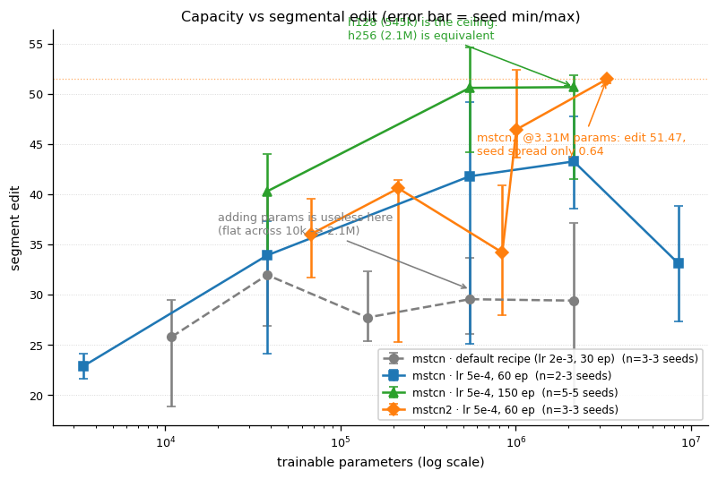
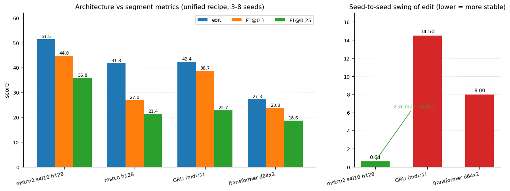
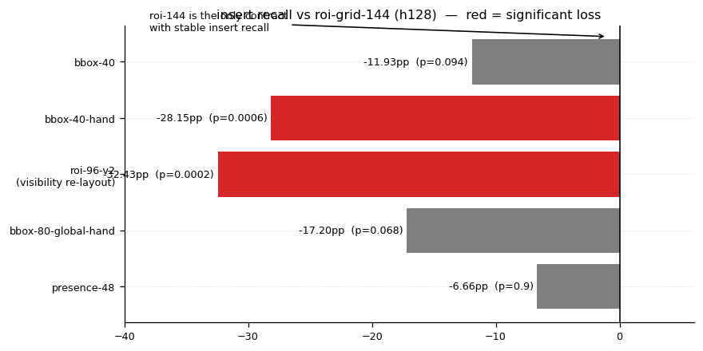
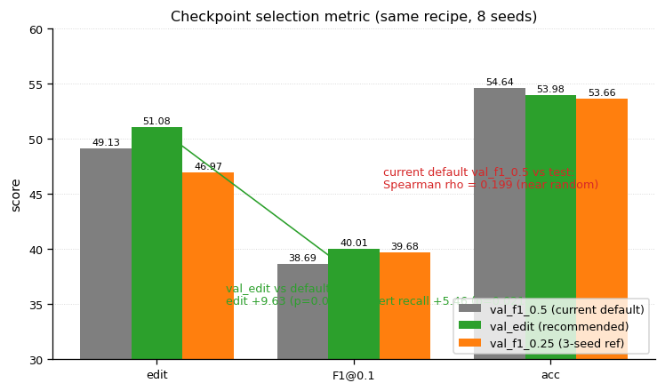
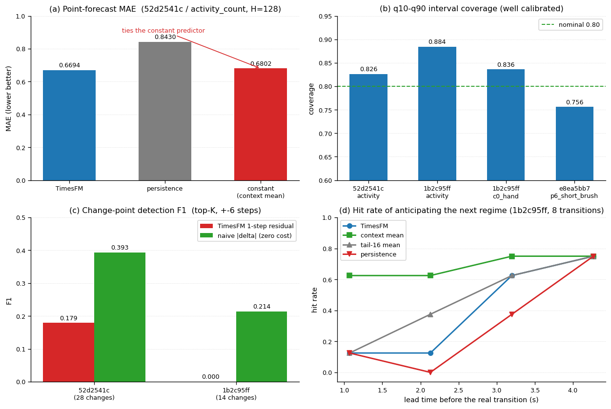
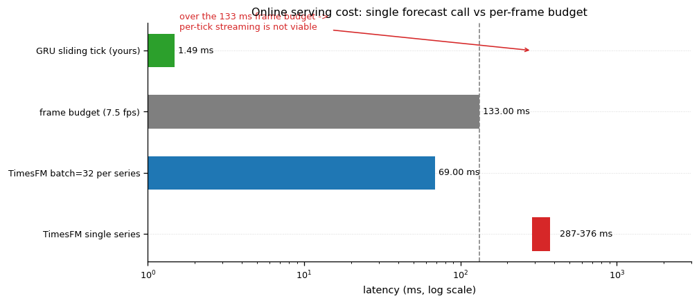
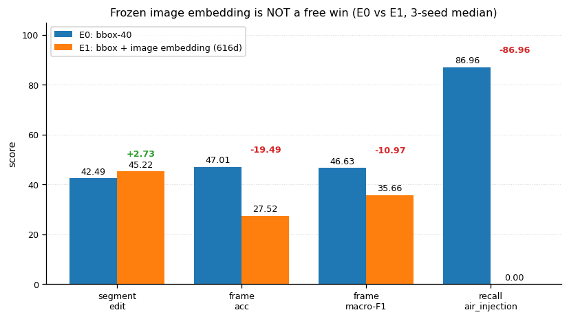

# 本周工作周报（2026-09-19 ~ 09-24）

- 汇报日：2026-09-24（周四）
- 覆盖期：2026-09-19 ~ 2026-09-24（沿用 [`MSTCN_CAPACITY_STUDY.md`](mstcn-capacity/MSTCN_CAPACITY_STUDY.md) 的"本周 09-19 ~ 09-22"口径，续上 09-23 / 09-24）
- 性质：**汇总周报**——只引用已定版报告的数字，不产生新指标；各条线的完整口径与原始数字见对应报告
- 归属：本仓库（模型训练 / 离线评估 / benchmark / checkpoint 契约 / 交付清单）

## 0. 一屏汇报要点

**本周三条主线全部收官，共同点是：都在"回答值不值得"，而不是"堆新模型"。**

1. **容量轴（09-19~09-22）**：加参数**没用**（默认配方下更糟）；`mstcn` 有效上限 h128；**换结构比加参数值**
   （`mstcn2` h128/s4l10 用 60 轮拿到 edit 51.47，逐 seed 摆幅仅 0.64）。
2. **特征/精度杠杆轴（09-23）**：13 个杠杆只有 **4 条被验证有效**——换架构 `mstcn2`、加宽 h128、
   用满 `roi-grid-144`、**换选点口径 `best_metric=val_edit`**（本次新增结论，edit +9.63 / p=0.0107）；
   其余 9 条保持默认或直接不用。**"换特征提取方式"这条轴已探尽，没有任何替代契约超过 roi-144。**
3. **TimesFM 可行性探针（09-24）**：Google 时序基础模型的"预测式预警"路线**证伪**，
   **不建议引入主线**；唯一可保留的是离线的粗粒度流程偏离监控（需业务位点）。
4. **支撑线**：时序/分类指标口径统一为唯一注册表（选点词表 3→5，新增一致性测试 15 条）；
   分类链内存 20 GiB → 4.2 GiB；多处工程缺陷修复。
5. **风险项（当日已处置）：本周 0 次提交**。写本报告时 `HEAD` 仍停在 `6e9ef17`（09-05），
   **79 个文件**（37 改 + 42 新）全部未入库，跨 09-11 ~ 09-24 两周工作量 —— **已于当日按功能
   拆成 20 个提交并推送到 `origin/feat/roi-training`（见 §5.1 补记）**；另有 7 个测试红灯需要处置（详见 §5）。

## 1. 主线一：MS-TCN 容量轴研究（09-19 ~ 09-22，结题 09-22）

**产出**：[`docs/mstcn-capacity/MSTCN_CAPACITY_STUDY.md`](mstcn-capacity/MSTCN_CAPACITY_STUDY.md)（合并原 PARAMS_INVENTORY / PARAMS_VS_INPUT_DIM /
CAPACITY_EXPERIMENT / CAPACITY_LR_FOLLOWUP / GAP_FILLING 五份）、配套 [`tools/run_capacity_matrix.py`](../tools/run_capacity_matrix.py)、
[`tools/plot_capacity_curves.py`](../tools/plot_capacity_curves.py)、容量矩阵曲线图。

**规模**：**122 个 run**（110 个带正式评估），全部 CPU 训练；数据口径 `cleansight-ActionMixed-auto-lhh`
revision `6375eba9…`，test 8 视频。

**结论（四问四答）**

| 问题 | 结论 |
|---|---|
| 现在多大？ | `mstcn` 3.5–3.8 万参（0.038M），四种时序架构里最小；87% 参数在 8 个残差块，**与输入维度几乎无关**（40→144 维只 +9%） |
| 加参数有用吗？ | **默认配方（lr=0.002）下没用，还更糟**；把 lr 降到 1/4 后有用，但 `mstcn` **h128 到顶**（h128 vs h32 逐 (seed,视频) 配对 28/10、p=0.0026；h256 与 h128 等价 p=0.80） |
| 什么比加参数更值？ | **换结构**：`mstcn2`（深监督 + 双膨胀 + T-MSE + dropout）h128/s4l10 用 60 轮 edit **51.47**、逐 seed 摆幅仅 **0.64**，超过 `mstcn` 跑 150 轮水平；h128/s2l5（100 万参）用 1/3 参数拿到其 ~90% |
| 另一条更便宜的杠杆？ | **特征维度**：同配方下 40→144 维，h32 的 edit 26.14 → **33.91**（配对 p=0.020），坍缩明显减少，代价仅 +9% 参数 |

> 图 1：容量 vs 段级 edit（4 条配方，误差棒 = seed 极差）。可见默认配方在 1 万→210 万参区间**几乎平坦**；
> 降 lr 后曲线才抬升，但 h128（54.6 万参）之后**不再增长**；`mstcn2` @331 万参达到 edit 51.47 且 seed 摆幅仅 0.64。
> 数据：真实 run 级数据 + 容量研究 §0/§1。

**本周内附带完成**（同文档 §0.1）：指标口径统一、容量实验三轮（默认配方 / lr×预算三臂 / 缺口修补）、
输入维度轴、数据规模旋钮 `data.train_video_fraction`（学习曲线**不单调**，协议待改随机子集）、
分类（ROI）侧链路跑通（20,394 裁剪）且内存从 ~20 GiB 降到 **4.2 GiB**。

## 2. 主线二：特征提取方式与精度杠杆（09-23，结题 09-23）

**产出**：[`docs/EXPERIMENT_REPORT_FEATURE_ACCURACY_20260923.md`](EXPERIMENT_REPORT_FEATURE_ACCURACY_20260923.md)（13 杠杆 × 多 seed）、
逐轮机制回写 [`docs/FEATURE_STRATEGY_COMPARE.md`](FEATURE_STRATEGY_COMPARE.md)（第十三~二十七轮）。

**规模**：**新增 122 个 run / 128 份正式评估**（另复用容量研究既有批次作对照），全部 CPU。
统计口径：逐 (seed,视频)×类配对 Wilcoxon，一律同 seed 配对；强制同时报非 idle 帧数与段数比
（防"靠压掉非 idle 换 edit"的假增益）。

**定版结论：13 个杠杆只有 4 条有效**

| # | 杠杆 | 定版 | 效果 |
|---|---|---|---|
| 1 | 架构族 | **`mstcn2`** | GRU(md=5) 相对它 edit −15.14（8-14，p=0.0348）；Transformer −24.24（5-18，p=0.0062） |
| 2 | 宽度 | **h128** | h64→h128 **+16.67**（17-2，p=0.0003）；h32→h128 **+18.38**（15-6，p=0.0142） |
| 3 | 特征契约 | **`roi-grid-144`** | 替代契约 insert 召回 −11.9 ~ −32.4；96 维重排版 edit −18.80（p=0.0177） |
| 4 | **选点口径** | **`best_metric=val_edit`** | edit **+9.63**（29-13，p=0.0107）；insert 召回 **+5.46**（18-5，p=0.0214，8 seed） |

> 图 2：左 = 架构族指标对照；右 = **逐 seed 摆幅**（稳定性）。`mstcn2` 摆幅 0.64 对比 GRU 的 14.5
> ——**"能不能稳定复现"比单次跑分更重要**。口径：统一配方 lr 5e-4 / 60 轮 / CPU / 3~8 seed（特征报告 §2.3）。

**被否掉的 9 条**（保持默认或不用）：T-MSE 权重改动**有害**、序列去均值、活动量 clip、
目标随机遮罩、presence-only 契约、**多种子集成**（最好 k=8 只打平，edit −0.85 / p=0.81）、
更深、h256+、离线后处理平滑（val 选参后 edit 45.30 → 33.33；test 选参会造出 +22 分**假增益**）。

> 图 3：各替代契约相对 `roi-grid-144` 的 **insert 召回缺口**（红 = 配对检验显著）。口径：`mstcn2 s2l5 h128`、
> 3 seed、配对 Wilcoxon（特征报告 §2.2）。

> 图 4：同一配方只换 `best_metric`。`val_edit` 把 edit 从 49.13 抬到 **51.08**（+9.63，p=0.0107），
> 而现行默认 `val_f1_0.5` 与 test 的 Spearman ρ 只有 **0.199**（选点近乎随机）。8 seed（特征报告 §2.4）。

**最重要的一句**：**换特征提取方式这条轴已探尽——没有任何替代契约能超过 `roi-grid-144`。**

## 3. 主线三：TimesFM 时序基础模型可行性探针（09-24）

**产出**：[`docs/EXPERIMENT_REPORT_TIMESFM_FEASIBILITY_20260924.md`](EXPERIMENT_REPORT_TIMESFM_FEASIBILITY_20260924.md)（模型
`google/timesfm-2.5-200m-pytorch`，Apache-2.0 权重；4 个 val 视频 × 4 条派生序列；全部 CPU）。

**判定：预测式预警路线证伪，不建议引入主线。** 四条证据：

1. 点预测只比 persistence 好 7–25%，长视野**与"永远猜常数"打平**（0.6694 vs 0.6802）；
2. 1 步残差定位动作切换的 F1（0.00–0.18）**输给成本为零的一阶差分**（0.07–0.39）；
3. 加上对照基线后，"提前 4 秒预警"的能力**完全消失**（TimesFM 0.75 = context 均值 0.75）；
4. 剩余时长预测失败（多数段触发不了；触发段 MAE 24.5–37.7 步 > 常数基线 6.5–11.0 步）。

> 图 5：四问全部带零成本对照。(a) 长视野 MAE 与常数预测打平；(b) 唯一强项是区间校准；
> (c) 切换点检出**输给一阶差分**；(d) 加对照后"提前预警"能力消失（TimesFM 在前两个 lead 明显更差）。
> 口径：`timesfm-2.5-200m` 零样本、4 个 val 视频、CPU（TimesFM 报告 §4）。

部署口径：单序列调用 **0.287–0.376s**（GRU 滑窗 1.49ms、帧预算 133ms）→ 在线逐 tick 不可行。
唯一正面发现：**分位数区间校准良好**（覆盖率 0.756–0.884 vs 名义 0.80），可支撑离线粗粒度偏离监控。

> 图 6：在线代价（对数刻度）。TimesFM 单序列 287–376 ms（区间条为报告实测区间），
> 而帧预算只有 133 ms、你们 GRU 单 tick 是 1.49 ms —— **逐 tick 流式不可行**，
> 只有低频旁路（每 5–10 s 触发）可行。口径：本机 CPU 实测 + [`docs/INFERENCE_CHAIN_PERF.md`](INFERENCE_CHAIN_PERF.md)。

## 4. 支撑线：指标口径统一与工程修复（09-20 ~ 09-23）

| 项 | 内容 | 落点 |
|---|---|---|
| 指标口径统一 | 时序 14 项 + 分类 4 项指标建立**唯一注册表**；训练选点 / 正式评测 / history / 曲线 / 矩阵工具 / 文档全部引用它；选点词表 3 → 5；新增一致性测试 15 条 | [`core/metrics.py`](../framework/cleansight_eval/core/metrics.py)、[`docs/EVAL.md`](EVAL.md) §3.4/§3.5、[`tests/test_metric_consistency.py`](../tests/test_metric_consistency.py) |
| 分类链修复 | `_fit` 嵌套 state_dict 崩溃、`predict` 结构超参缺失、mmap + 逐样本转换（内存 ~20 GiB → 4.2 GiB） | [`classification/data.py`](../framework/cleansight_eval/classification/data.py)、[`classification/pipeline.py`](../framework/cleansight_eval/classification/pipeline.py)、[`benchmark/evaluators/classification.py`](../benchmark/evaluators/classification.py) |
| 新增旋钮 | `data.train_video_fraction`（学习曲线）、序列归一化、`class_weight_clip` | [`core/config.py`](../framework/cleansight_eval/core/config.py)、[`temporal/util.py`](../framework/cleansight_eval/temporal/util.py)、[`temporal/full_sequence_pipeline.py`](../framework/cleansight_eval/temporal/full_sequence_pipeline.py)、[`temporal/sliding_window_pipeline.py`](../framework/cleansight_eval/temporal/sliding_window_pipeline.py) |
| 新增探针工具 | 6 个：[`probe_channel_subsets`](../tools/probe_channel_subsets.py) / [`probe_boundary_error`](../tools/probe_boundary_error.py) / [`probe_selection_transfer`](../tools/probe_selection_transfer.py) / [`probe_seed_ensemble`](../tools/probe_seed_ensemble.py) / [`probe_segment_visibility`](../tools/probe_segment_visibility.py) / [`probe_offline_postprocess`](../tools/probe_offline_postprocess.py)，**各配单测**；另新增 [`compare_runs.py`](../tools/compare_runs.py) | [`tools/`](../tools/)、[`tests/`](../tests/) |
| 文档回写 | [`EVAL.md`](EVAL.md)、[`YAML_CONFIG.md`](../usage/YAML_CONFIG.md)、[`features/README.md`](features/README.md)、[`FEATURE_STRATEGY_COMPARE.md`](FEATURE_STRATEGY_COMPARE.md)、[`MODELSET_OVERVIEW.md`](MODELSET_OVERVIEW.md) | [`docs/`](README.md)、[`usage/`](../usage/) |
| 已知未修 | `--resume` 语义错位（仅记录）；学习曲线协议待改随机子集 | [`MSTCN_CAPACITY_STUDY.md`](mstcn-capacity/MSTCN_CAPACITY_STUDY.md) §0.1/§0.2 |

## 5. 仓库状态与风险（本周最需要处置的一条）

### 5.1 零提交

`HEAD` = `6e9ef17`（**09-05** 20:02），**本周乃至 09-11 以来的全部工作均未入库**：

| 类别 | 数量 | 说明 |
|---|---:|---|
| 已跟踪被修改 | **37** | 跨 09-11 ~ 09-23 |
| 新增未跟踪 | **42** | 含 4 份实验报告、1 个报告目录、5 个实验 YAML、10 个测试、11 个探针工具、3 个 feature 模块 |
| 本周新增/改动的 run 目录 | **73** | 全部在 gitignored 的 `runs/` 下 |

**风险**：两周工作量只在本地工作树，无提交历史、无 review 记录、无法并行推进。

> **补记（2026-09-24 当日处置）**：上述 79 个文件已按**功能边界**拆成 **20 个提交**并推送，
> 分支 `feat/roi-training` 与远端一致（`ahead 0 / behind 0`）。提交分组：
> 指标口径 → 容量旋钮 → GRU → 图像 embedding → ROI v2 → ROI presence → 分类修复 →
> 探针工具 → 数据/manifest → 容量定版 → 特征杠杆定版 → 图像 E1 与总览 → TimesFM 探针 →
> 周报 → docs 分类索引 → 忽略会话日志 → 图表库 → 周报嵌图 → V3 评审 → 周报引用加链接。
> 累计涉及 **100 个文件**（含后加的图表库 15 个文件与文档）。
> 原始风险记录保留如上，不改写历史状态。

### 5.2 测试基线：7 红 / 399 绿（28s）

| 失败项 | 性质 |
|---|---|
| `test_architecture_boundaries` × 2 | **架构门禁红灯**：12 个违规文件中 **10 个来自已提交旧文件**（HEAD 上即红），本周改动**新增 2 个**（[`tools/probe_pixel_channel.py`](../tools/probe_pixel_channel.py)、[`tools/run_strategy_matrix.py`](../tools/run_strategy_matrix.py)） |
| `test_config_paths`、`test_temporal_masking`、`test_pipeline_smoke` | **预先存在**（09-11 的 E1 报告已记录，`HEAD` 同样失败） |
| `test_predict_timeline` | 数据集版本漂移（引用旧视频名 `05ba4406-…`，数据已升级） |
| `test_checkpoint_compat` | torchscript 归档加载（环境/权重相关） |

**结论**：本周未提交改动**不是**这批红灯的主因；门禁要变绿需先处置 12 个既存违规文件
（超出本周范围，建议单独立项）。

## 6. 下周建议（按依赖排序）

1. ~~**先入库**：把 79 个文件按功能拆成若干提交（指标口径 / 容量轴 / 特征契约 / 探针工具 /
   分类链 / 实验报告），恢复提交历史与 review 能力。~~ **✅ 当日完成**：20 个提交已推送
   （分组见 §5.1 补记）；后续只需 review 与按 `docs/BRANCH_CONVENTION.md` 合并。
2. **门禁债务单独立项**：12 个架构边界违规需要一次性决策（放宽 `tools/` 的运行规则，
   还是把执行模型的工具下沉到允许层），否则 `tests/` 长期保持红灯。
3. **选点口径落地**：`best_metric=val_edit` 已验证有效（edit +9.63，p=0.0107），
   需决定是否把它写进正式配方默认值，并同步 [`EVAL.md`](EVAL.md) 与实验 YAML。
4. **正式轮前置**：图像源（project-16 抽帧）与 v3 数据对齐完成后，按 E 系列机制床结论推进 E2/E3；
   注意 E1 已显示图像通道**不是免费增益**（帧级 acc 47.01 → 27.52）。

5. **TimesFM 相关**：按探针结论**不进入主线**；若要保留离线偏离监控，需先确认业务位点。

> 图 7：E0（bbox-40）vs E1（bbox + 616 维冻结图像 embedding）。段级 edit 升（42.49 → 45.22），
> 但帧级 acc / macro-F1 **显著降**、`air_injection` 召回直接归零 —— **图像通道不是免费增益**，
> 引用时必须同时给出这两面。口径：机制床 9,532 帧、CPU、3 seed 中位数（E1 报告 §4）。

## 7. 附：更早的产出（09-11 ~ 09-18，写本报告时尚未入库，已随 §5.1 补记的批次一并提交）

- **09-11**：图像 embedding 契约（形态 B）——[`image_embed.py`](../framework/cleansight_eval/temporal/features/image_embed.py)、GRU 投影头、E0/E1 机制床对照报告。
- **09-14**：输入设计提案 [`docs/features/INPUT_DESIGN_PROPOSAL.md`](features/INPUT_DESIGN_PROPOSAL.md) + 体检探针 [`probe_input_features.py`](../tools/probe_input_features.py)。
- **09-18**：ROI 可见性重排 v2 契约（96 维）、数据下载/manifest 重划、GRU 归一化与因果平滑测试、
  4 个专项探针（`probe_split_shift` / `probe_direction` / `probe_pixel_channel`）、
  [`usage/FEATURE_EVAL_RUNBOOK.md`](../usage/FEATURE_EVAL_RUNBOOK.md) 实操手册。

这些与本周主线同属一条"提精度"工作流，建议随本周产出一起入库。

## 8. 引用来源

- [`docs/mstcn-capacity/MSTCN_CAPACITY_STUDY.md`](mstcn-capacity/MSTCN_CAPACITY_STUDY.md)（容量轴，09-22 合并定版）
- [`docs/EXPERIMENT_REPORT_MSTCN_CAPACITY_20260922.md`](EXPERIMENT_REPORT_MSTCN_CAPACITY_20260922.md)（容量轴实验报告，09-23 回写）
- [`docs/EXPERIMENT_REPORT_FEATURE_ACCURACY_20260923.md`](EXPERIMENT_REPORT_FEATURE_ACCURACY_20260923.md)（13 杠杆定版）
- [`docs/FEATURE_STRATEGY_COMPARE.md`](FEATURE_STRATEGY_COMPARE.md)（第十三~二十七轮逐轮机制）
- [`docs/EXPERIMENT_REPORT_TIMESFM_FEASIBILITY_20260924.md`](EXPERIMENT_REPORT_TIMESFM_FEASIBILITY_20260924.md)（TimesFM 探针）
- [`docs/EXPERIMENT_REPORT_IMAGE_EMBED_E1_20260911.md`](EXPERIMENT_REPORT_IMAGE_EMBED_E1_20260911.md)（E0/E1 机制床）
- 口径与索引回写：[`docs/EVAL.md`](EVAL.md)、[`usage/YAML_CONFIG.md`](../usage/YAML_CONFIG.md)、[`docs/features/README.md`](features/README.md)、[`docs/features/INPUT_DESIGN_V3_REVIEW_20260924.md`](features/INPUT_DESIGN_V3_REVIEW_20260924.md)
- **图表库**：[`docs/figures/README.md`](figures/README.md)（本报告引用的 7 张图及其 JSON 旁证、生成脚本 [`tools/plot_report_figures.py`](../tools/plot_report_figures.py)）
- **文档总导航**：[`docs/README.md`](README.md)
