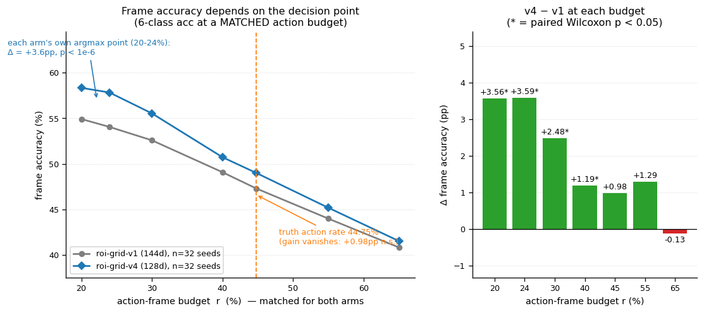
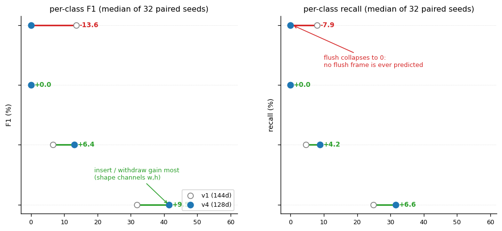
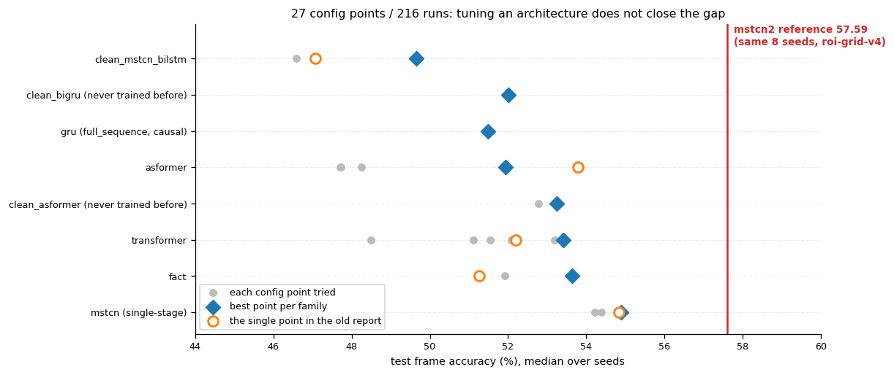

# 技术同步稿：本周工作（2026-09-26 ~ 10-02）

> **给技术同事的 20~30 分钟同步稿**，是 [`STAGE_REPORT_20260929.md`](STAGE_REPORT_20260929.md)（只讲到 09-29）
> 的**续篇兼合并版**：09-29 之前的内容保留在该文，本文补齐 10-01 的三件事并给出**统一口径**。
> 一页纸版见 [`WEEKLY_ONEPAGER_20261001.md`](WEEKLY_ONEPAGER_20261001.md)；
> 结论与证据指针见 [`WEEKLY_ARCHIVE_20261001.md`](WEEKLY_ARCHIVE_20261001.md)。

## 时长对照

| 你有 | 讲这些 |
|---|---|
| 5 分钟 | §1 一屏全景 + §5 口径变更提示 |
| 15 分钟 | 再加 §2 主线（同预算拆解）+ §3 增益长什么样 |
| 30 分钟 | 全部，含 §4 三个钉死的事实与 §7 可复用产出 |

---

## 1. 一屏全景

本周三条线，**一条正向、两条把路关掉**：

| 线 | 做了什么 | 结果 |
|---|---|---|
| **A 改进** | 特征契约 `roi-grid-v1`(144d) → `v4`(128d)：把冗余的 `presence` 通道换成 `w,h`（补回长宽比），并重排维度预算 | 帧准确率 **53.90 → 58.31**（32 对 seed，**+4.47pp，32/32，p=7.9e-07**） |
| **B 剖析** | 对已收口的 11 个课题做**证据审计 + 口径重估**（135 条逐条复核） | 方向性结论都保住，但 **4 条的幅度/强度下调**（架构、检测、指标强度、fold）；见 §5 |
| **C 补测** | 补上此前自认"没做"的两件事：离线上线、架构公平性 | **离线→流式：功能消失**；**架构：27 配置点全败** |

**本周的"钱花在哪"一句话**：唯一有效的仍是**特征契约的维度预算与通道语义**；
唯一还没被排除的路径是**目标批次数据**。

---

## 2. 主线：+4.4pp 到底是多少

### 2.1 先把统计单元说清

| 口径 | 数字 |
|---|---|
| seed 级（n=32 配对） | **+4.47pp**，32/0，p=7.9e-07，95% CI [+3.34, +5.11] |
| 视频级（n=8） | 逐视频 Δ 全为正，但 p 只有 **0.008~0.070**；**单个视频贡献约一半增益** |
| 帧级独立性 | ICC 0.014~0.018 → 设计效应 5.6~7.0 → **2639 帧只值 376~470 个独立样本** |

→ 引用规则：**凡"提升"必须写统计单元**；换一批视频的区间是 **[+1.41, +8.58]**（比 seed 级宽 4 倍）。

### 2.2 再看决策点：acc 奖励保守预测

*图（32 对 seed，test 2639 帧）：横轴 = 预测非 idle 帧占比（两臂**同一预算**），纵轴 = 6 类准确率。*

- 两臂 argmax 落在**不同预算**上：v1 23.97% vs v4 20.06%（真值 44.75%）→ v4 更保守。
- 拉到**同一预算**（各自 argmax 附近）差 **+3.56 / +3.59pp**（29/3、28/4，p≤1.4e-06）——**改进是真的**；
- 但要求"报得和真值一样多"（44.75%）时 **+0.98pp 且不显著**（p=0.087）。
- 结论：**+4.47pp 里约 0.9pp 是工作点效应**，其余是表示/判别力。
  （注意：加性分解"判别力 X% / 工作点 Y%"在两个参照点下**符号相反**，不可识别，不要那样报。）

### 2.3 增益长什么样：类间重分配

*图（32 对 seed，逐类 frame 指标中位）：实心 = v4，空心 = v1。*

| 类 | F1 变化 | 召回变化 |
|---|---:|---:|
| `long_brush_insert` | **+9.46pp**（31.9→41.4） | +6.58pp |
| `long_brush_withdraw` | **+4.63pp**（6.7→13.0） | +4.25pp |
| **`flush`** | **−13.55pp**（13.6→**0.0**） | **−7.93pp**（7.93%→**0.00%**） |
| 动作类宏平均召回 | — | **+0.01pp（16/16，p=0.93）** |

- 误差分解（逐帧，32 seed）：净 **+4.51pp** = **+3.19**（少误报 idle，占 70.6%）− **1.47**（多漏动作帧）+ **2.80**（动作类间混淆减少）。
  → v4 是"**更保守 + 更会分动作类**"，不是"什么都更好"。
- **机制（本轮新测）**：flush 真值帧上 v4 的 argmax **从不输出 flush 类**（0.0%）；
  同一个 20% 动作预算下，flush 帧被门控保留的比例 v1 5.4% → v4 **0.2%**。
- **对下游的含义**：若需要 flush 事件，v4 不能直接上线；`acc` 与平衡口径都不会提示这一点。

---

## 3. 三个"钉死"的事实（本周新增）

### 3.1 架构不是杠杆——而且这次给了每族公平的调参机会

*图：27 个配置点（每族 1~7 个 lr × 容量组合）在**同一批 A seed** 上的 test acc 中位；
红线 = `mstcn2` 参考（同 seed，57.59）。*

| 族 | 配置点数 | 最好点 | acc | Δ vs 参考 | 胜/负 |
|---|---:|---|---:|---:|---|
| `mstcn`（单阶段） | 3 | h128 lr1e-4 | **54.89** | **−3.43** | 0/8 |
| `fact` | 2 | d256 lr5e-4 | 53.64 | −4.32 | 0/8 |
| `transformer` | 7 | d128 lr5e-4 +warmup/cosine | 53.41 | −4.17 | 0/8 |
| `clean_asformer`（**从未训练过**） | 2 | h64 lr5e-4 | 53.24 | −3.77 | 0/8 |
| `clean_bigru`（**从未训练过**） | 1 | h64 lr5e-4 | 52.01 | −6.26 | 0/8 |
| `asformer` | 4 | h64 lr1e-4 | 51.94 | −5.38 | 0/8 |
| `gru`（full_sequence，因果） | 1 | h128 lr5e-4 | 51.49 | −6.48 | 0/8 |
| `clean_mstcn_bilstm` | 2 | h256 lr5e-4 | 49.66 | −6.99 | 0/8 |

- **同预算对照**（挑战者与参考都给 180 轮）：参考 **57.60 vs 57.59（无变化，60 轮即收敛）**；
  唯一受益的 `transformer` lr5e-5 也只 51.53 → **53.19**，仍差 4.4pp。→ **差距不是训练预算造成的。**
- **16 对 seed 复核**（最好三族各补 8 seed）：`mstcn` **54.41（−3.58，0/16，p=3.1e-05）**。
- **族内调参收益整体落在 seed 噪声里**：逐 seed Δ 范围最宽到 [−10.2, +12.5]；
  两个估计量（中位差 / 配对中位差）在 `mstcn` 上**符号相反**（+0.06 / −1.40）。
- 附带发现：唯一接近参考的恰是**同为 TCN 族的单阶段 `mstcn`** → **"多阶段精化"这个结构本身值 ≈3.6pp**，
  比任何调参都大。

### 3.2 离线模型不能靠"加个滑窗"上线

把**已训的离线非因果 `mstcn2`** 按"每帧只能看过去 W 帧"部署（W=8~645，脚本内置末帧一致性自检 8/8 通过）：

| lookback W | 8 | 16 | 32 | 64 | 128 | 256 | 645（≥最长视频） | 离线 |
|---|---:|---:|---:|---:|---:|---:|---:|---:|
| acc（3 个模型） | 55.25×3 | 55.25×3 | 55.25/55.10/55.25 | 55.25/55.82/55.25 | 54.07/52.41/54.11 | 55.25/53.43/55.25 | 54.98/54.79/55.25 | **57.07/58.39/58.89** |
| **非 idle 预测率** | **0.00%** | 0.00% | 0.04% | 0.00% | 1.17% | 0.00% | 0.27% | **18.30%** |

- **不是"掉几个点"，是功能消失**：模型退化成恒输出 idle 的常数预测器，
  准确率恰好等于全 idle 平凡基线 **55.25%**（W=128 时甚至低于基线 1~2.8pp）。
- 原因与**有效感受野远大于窗口**一致（4 stage × 10 层空洞卷积）。
- 旁证：仓库历史 `benchmark/temporal_feed_mode/latest/`（同一 checkpoint 换喂法）
  `gru` acc 87.29→91.00、`transformer` 65.77→90.59 → **喂法轴本身是 ≥4pp 量级的主效应**。
- **含义**：`roi-grid-v4` 的全部收益只在**整段离线**设定下成立；上线要么换因果架构重训（架构轴已证差 3.6~9pp），
  要么整段批处理。

### 3.3 指标的分辨力比原以为的差

- 有效样本量只有名义的 1/6（见 §2.1）；**两条独立 run 相比，最小可检测差 ≈ 9.1pp**。
- 配对设计下的可检测效应：8 seed **1.91pp** / 16 seed **1.35pp** / 32 seed **0.95pp** / 128 seed **0.48pp**。
- → **原"判 <0.5pp 用 ≥32 seed"不成立**；这也作废了此前给 v6 契约定的"判读门限 0.5pp"。

---

## 4. 四条适用边界（随结论一起引用）

1. **架构与主语**：全部数字的主语是 `mstcn2` h128 s4l10 + **整段非因果**推理；
   契约收益**补偿不了架构差距**（同契约喂给单阶段 `mstcn` 仍是 −3.94pp）。
2. **数据范围**：14 训练视频 / 9,575 帧、test 8 视频 / 2,639 帧（跨批次 + 定向构造，idle 占 55.25%）。
3. **评测口径**：`best.pt` + 逐帧 argmax + 零平滑；**每报一次 `acc` 必须带一个段级指标**——
   同批 seed 上 `edit` 是 **−8.32pp**（7/25，p=4.4e-05）。
4. **目标批次**：v4 在目标批次上的增益**分布不均**（LOO 区间 [+2.55, +5.80]，约 40% 集中在单个视频）。

---

## 5. ⚠️ 口径变更提示（本周最重要的一页）

10-01 的逐条审计把 4 条的幅度/强度下调；**引用 09-29 版本的 PPT/报告前请对照**：

| # | 旧说法 | 新说法 | 依据 |
|---|---|---|---|
| 1 | 架构轴：五架构全败（**每族只有 1 个配置点、沿用 mstcn2 配方**） | 已补公平性网格（**27 点 / 216 run**）：**最好点仍差 3.58pp（0/16）** → 结论不变，但**现在才真正排除"没调参"** | §3.1 |
| 2 | "`w,h` 替换 `presence` ⇒ **+3.67pp**（严格单变量）" | 真·单变量（v2→v4）：**test +2.05pp / val −0.56pp**；+3.67pp 是含网格与低频改动的联合差 | 审计附录 03_04 |
| 3 | 检测侧"不是瓶颈"（含"冷类可整体砍掉、不亏"） | 事实层成立；但"冷类可砍"与仓库既有 32-seed 重训 **−0.72~−0.91pp** 相反，**且随机块对照带换个 RNG 种子就翻转 3 处判读** | 审计附录 06_07 |
| 4 | "增益稳定 +4.4~4.5pp"（CI [+3.33,+5.11]）／"0.5pp 用 32 seed" | 视频级 CI **[+1.41, +8.58]**；32 seed 只能判 **0.95pp**（0.5pp 需 ≈128 seed） | §2.1 / §3.3 |
| 5 | "流式迁移未验证" | 已实测：**功能消失**（§3.2） | §3.2 |
| 6 | boxset"比 v4 低 7.84pp"；§3.8 逐视频 Δ 列 | 前者是相对 **v1** 的错标（对 v4 实为 −12.4pp）；后者用了文档自己禁止的"目录序配对" | 审计附录 03_04 |

---

## 6. 可复用产出

- **新的评测口径工具**（都可复跑）：同动作帧预算比较、ICC/设计效应、三级不确定度与分辨力表。
- **架构公平性网格**：`tmp/arch-fair/{run_grid.sh,run_grid2.sh,run_promote.sh,compare_grid.py,summarize.py}`；
  产物 `runs/arch-fair/`（27 点 / 216 run）。
- **离线→流式探针**：`tmp/deepdive/offline_stream.py`（含末帧一致性自检）。
- **三张报告图**（`docs/figures/`，PNG + JSON 旁证 + 生成脚本 `tools/plot_report_figures.py`）。
- **逐条证据审计**：`AUDIT_TOPIC_{03_04,06_07,09_11}_20261001.md`（135 条主张，✅/⚠️/🔁/❌）。

---

## 7. 下一步（按性价比）

1. **`flush` 专项**（决定 v4 能否上线）：先回答"下游是否需要 flush 事件"；
   若需要，建 v4+presence / v4+冷类 2×3 两个中间契约，各 32 seed（按 §3.3 的分辨力，1pp 量级必须 ≥32 seed）。
2. **工作点显式化**：上线前用目标动作率而非 argmax 定工作点，并重测段级指标与段覆盖率。
3. **判读门限落地**：把"1.5pp/8 seed"改为"**1pp/32 seed、0.5pp/≈128 seed**"。
4. **目标批次数据**（外部阻塞项，需决策）：3~4 个视频参与训练/微调即可把"批次差异能否在训练侧消掉"变成可测。

---

## 8. 附录：最可能被问的 8 个问题

| 问 | 答 |
|---|---|
| 为什么说架构不是杠杆？ | 27 配置点 / 216 run，含两个**从未训练过**的架构补训与 3 倍预算对照；最好点 −3.43pp（0/8），16 seed 复核 −3.58pp（0/16）。 |
| 是不是没调参？ | 已补：每族 1~7 个 lr × 容量点；族内调参收益整体落在 seed 噪声内（逐 seed Δ 最宽 [−10.2,+12.5]）。 |
| 是不是训练不够久？ | 同预算对照：参考 60 轮即收敛（180 轮无增益）；唯一受益者 `transformer` 也只 +0.5pp，仍差 4.4pp。 |
| +4.4pp 是真的吗？ | seed 级是真的（32/32，p=7.9e-07）；但同预算下是 **+3.6pp**，且**视频级 p 只有 0.008~0.070**。 |
| 能不能直接上线？ | **不能**：离线模型按窗口部署会塌成常数预测器（非 idle 预测率 18.30%→0.00~1.17%）。 |
| 段级指标呢？ | 同批 seed 上 `edit` **−8.32pp**（7/25，p=4.4e-05）；`f1@0.25` 持平（+1.29，p=0.118）。 |
| flush 怎么办？ | v4 把 flush 召回打到 **0.00%**；需先确认下游是否需要该事件。 |
| 下周最该做什么？ | ① flush 专项 ② 工作点显式化 ③ 争取目标批次数据（唯一可能跨 +5pp 线）。 |
